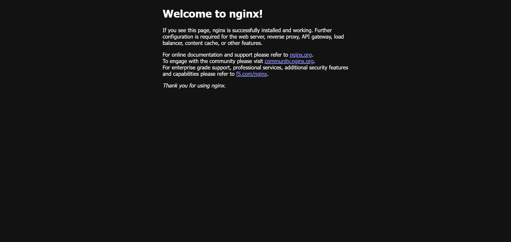
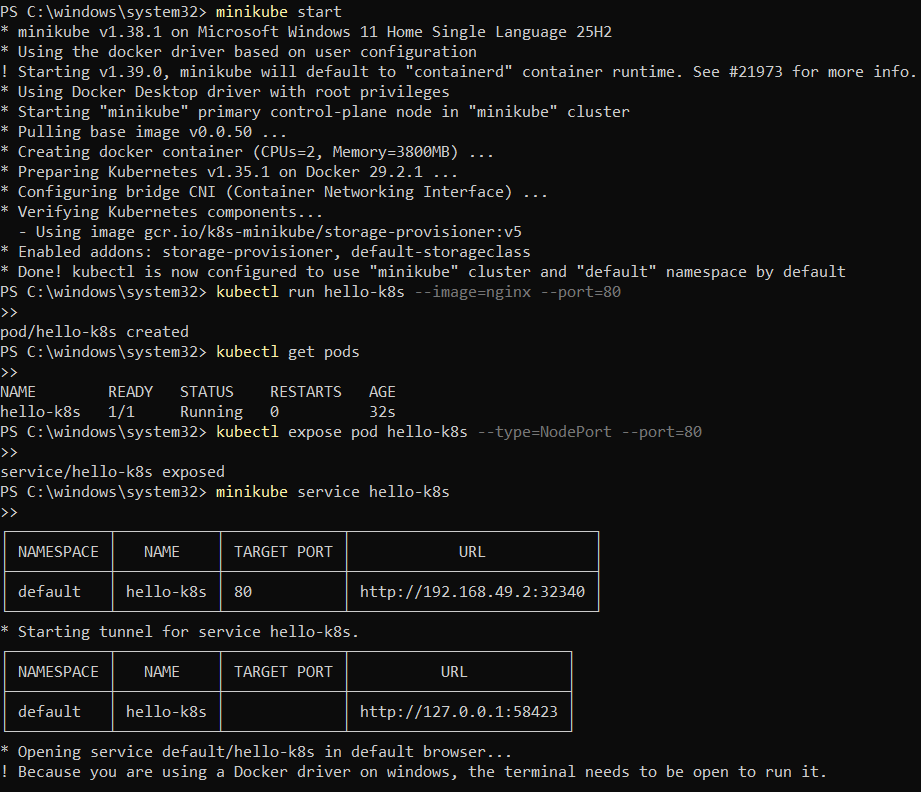

# Exercise 1 – Hello Pod

## Objective

Deploy an Nginx container as a Kubernetes Pod using Minikube, expose the Pod using a NodePort Service, and access the application through a web browser.

This exercise demonstrates the basic Kubernetes workflow of creating a Pod, exposing it through a Service, and accessing the deployed application.

---

## Business Problem

Consider a DevOps Engineer working at **Zepto**. The product team has developed a lightweight web application representing the storefront and delivery status page.

As a DevOps Engineer, the task is to deploy this application on Kubernetes so that it can run reliably, remain portable, and be scaled in the future.

For this exercise, the Nginx container is used to simulate the web application.

---

## Environment

- OS: Windows 11 Home Single Language 26H2
- Kubernetes: v1.37.0
- Minikube: v1.39.0
- Container Runtime: Docker
- Kubernetes Driver: Docker
- Application: Nginx
- Pod Name: `hello-k8s`
- Container Port: `80`
- Service Type: NodePort

---

## 1. Start Minikube

Minikube was used to create a local single-node Kubernetes cluster.

### Command

```powershell
minikube start --driver=docker
```

Minikube successfully started using Docker as the container driver, and `kubectl` was configured to use the Minikube cluster.

The Kubernetes environment was successfully initialized and the cluster was ready to deploy applications.

---

## 2. Create the Nginx Pod

A Kubernetes Pod named `hello-k8s` was created using the Nginx container image.

### Command

```powershell
kubectl run hello-k8s --image=nginx --port=80
```

### Output

```text
pod/hello-k8s created
```

The command creates a Pod containing an Nginx container and specifies port `80` as the container port.

---

## 3. Verify the Pod

The status of the Pod was checked using:

```powershell
kubectl get pods
```

The Pod successfully reached the `Running` state.

### Output

```text
NAME        READY   STATUS    RESTARTS   AGE
hello-k8s   1/1     Running   0          ...
```

The `1/1` value under `READY` indicates that the single container inside the Pod is ready and running.

### Screenshot



---

## 4. Expose the Pod

The Pod was exposed using a Kubernetes NodePort Service.

### Command

```powershell
kubectl expose pod hello-k8s --type=NodePort --port=80
```

### Output

```text
service/hello-k8s exposed
```

The Service provides a stable way to access the application running inside the Pod.

The Service forwards traffic to port `80` of the Nginx container.

---

## 5. Access the Application

The Kubernetes Service was accessed using Minikube:

```powershell
minikube service hello-k8s
```

Minikube created a tunnel for the NodePort Service and opened the application in the default browser.

The service was successfully accessed through the browser.

---

## 6. Nginx Welcome Page

The Nginx default welcome page was successfully displayed in the browser.

This confirms that:

- The Minikube cluster is running.
- The Kubernetes Pod was successfully created.
- The Nginx container is running.
- The NodePort Service was successfully created.
- Network traffic was successfully forwarded to the Pod.
- The Nginx application is accessible.

### Screenshot



---

## 7. Kubernetes Architecture

The basic flow of the application deployment is:

```text
                    kubectl
                       |
                       v
              Kubernetes API Server
                       |
                       v
                  Scheduler
                       |
                       v
                Minikube Node
                       |
                       v
                    Kubelet
                       |
                       v
              Container Runtime
                   (Docker)
                       |
                       v
                Nginx Container
                       |
                       v
                    Port 80
                       |
                       v
             Kubernetes Service
                  (NodePort)
                       |
                       v
                   Browser
```

### Working

1. `kubectl` sends the Pod creation request to the Kubernetes API Server.
2. Kubernetes processes the requested Pod configuration.
3. The Scheduler assigns the Pod to the available node.
4. The Kubelet ensures that the Pod is created and running.
5. Docker acts as the container runtime and runs the Nginx container.
6. Nginx listens for HTTP requests on port `80`.
7. A NodePort Service exposes the Pod.
8. Minikube provides access to the Service.
9. The browser sends a request to the exposed Service.
10. The request reaches the Nginx container and the Nginx welcome page is returned.

---

## 8. Kubernetes Objects Used

### Pod

A Pod is the smallest deployable unit in Kubernetes.

The Pod created in this exercise was:

```text
hello-k8s
```

It contains the Nginx container.

### Service

A Kubernetes Service provides a stable way to access the application running inside the Pod.

The Service created in this exercise was:

```text
hello-k8s
```

The Service type was:

```text
NodePort
```

### Minikube

Minikube provides a local Kubernetes environment for learning and development.

In this exercise, Minikube was used with Docker as the container driver.

---

## 9. Commands Used

### Start Minikube

```powershell
minikube start --driver=docker
```

### Create Pod

```powershell
kubectl run hello-k8s --image=nginx --port=80
```

### Check Pods

```powershell
kubectl get pods
```

### Expose Pod

```powershell
kubectl expose pod hello-k8s --type=NodePort --port=80
```

### Access Service

```powershell
minikube service hello-k8s
```

---

## 10. What I Learned

Through this exercise, I learned the basic workflow of deploying an application on Kubernetes.

### Key Concepts Learned

- How Minikube provides a local Kubernetes cluster.
- How `kubectl` is used to interact with Kubernetes.
- How to create a Kubernetes Pod using an existing container image.
- How Kubernetes runs containerized applications inside Pods.
- How to check the status of Pods using `kubectl get pods`.
- How Kubernetes Services provide network access to Pods.
- How a NodePort Service exposes an application outside the Pod.
- How Minikube can be used to access Kubernetes Services locally.
- How Docker works as the container runtime for Minikube.
- The basic relationship between `kubectl`, Kubernetes components, Pods, containers, and Services.

---

## 11. Result

The Nginx application was successfully deployed as a Kubernetes Pod on a local Minikube cluster.

The Pod reached the `Running` state, was exposed using a NodePort Service, and the Nginx welcome page was successfully accessed through the browser.

Therefore, the **Hello Pod Kubernetes exercise was successfully completed**.