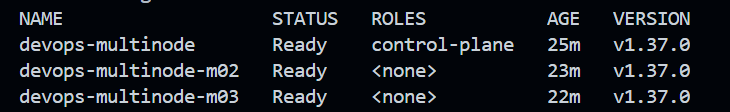
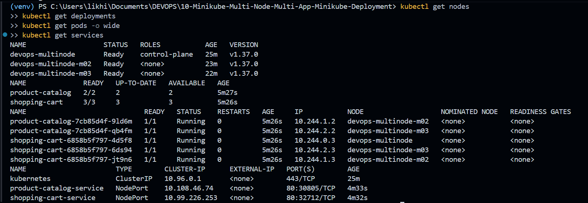
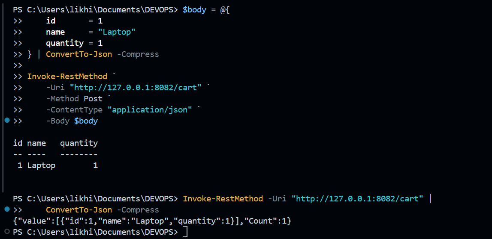

# Exercise 10: Multi-Node Kubernetes Cluster with Multiple Applications and ReplicaSets

## Aim

To deploy two Python Flask applications on a three-node Minikube Kubernetes cluster using Docker images, Deployments, ReplicaSets, and NodePort Services. The deployment uses pod anti-affinity to distribute application replicas across different nodes, improving availability and fault tolerance.

## Scenario

Consider an e-commerce application consisting of two independent services:

1. **Product Catalog (AppA):** Provides information about available products.
2. **Shopping Cart (AppB):** Allows users to view their cart and add items.

The Product Catalog runs with **2 replicas**, while the Shopping Cart runs with **3 replicas**. Each application's replicas are scheduled on different nodes to distribute workloads across the cluster.

## Technologies Used

- Docker Desktop
- Minikube
- Kubernetes
- Python 3.11
- Flask
- PowerShell
- Kubernetes Deployments, ReplicaSets, pod anti-affinity, and NodePort Services

## Project Structure

```text
10-Minikube-Multi-Node-Multi-App-Minikube-Deployment/
│
├── Images/
│   ├── ex10-01-cluster-and-pod-distribution.png
│   ├── ex10-02-deployments-and-services.png
│   └── ex10-03-application-testing.png
│
├── product_catalog.py
├── shopping_cart.py
├── Dockerfile.product
├── Dockerfile.shopping
├── product_catalog_deployment.yaml
├── shopping_cart_deployment.yaml
├── product_catalog_service.yaml
├── shopping_cart_service.yaml
└── README.md
```

## Step 1: Create a Multi-Node Minikube Cluster

Create a separate Minikube profile with three nodes:

```powershell
minikube start --nodes 3 -p devops-multinode --driver=docker
```

Check the cluster status:

```powershell
minikube -p devops-multinode status
kubectl get nodes
```

The cluster consists of one control-plane node and two worker nodes.

Expected node names:

```text
devops-multinode
devops-multinode-m02
devops-multinode-m03
```

All three nodes should eventually show `Ready`.

## Step 2: Implement the Product Catalog Application

Create `product_catalog.py`:

```python
from flask import Flask, jsonify

app = Flask(__name__)

products = [
    {"id": 1, "name": "Laptop", "price": 1200},
    {"id": 2, "name": "Phone", "price": 800},
    {"id": 3, "name": "Headphones", "price": 150},
]

@app.route("/products", methods=["GET"])
def get_products():
    return jsonify(products)

if __name__ == "__main__":
    app.run(host="0.0.0.0", port=80)
```

This application exposes the `/products` endpoint, which returns a JSON list of available products.

## Step 3: Implement the Shopping Cart Application

Create `shopping_cart.py`:

```python
from flask import Flask, jsonify, request

app = Flask(__name__)

cart = []

@app.route("/cart", methods=["GET"])
def get_cart():
    return jsonify(cart)

@app.route("/cart", methods=["POST"])
def add_to_cart():
    item = request.json
    cart.append(item)
    return jsonify(cart), 201

if __name__ == "__main__":
    app.run(host="0.0.0.0", port=80)
```

The Shopping Cart application provides two endpoints:

- `GET /cart` — Returns the current cart contents.
- `POST /cart` — Adds an item to the cart and returns the updated contents.

The cart uses in-memory storage for this exercise. Its contents are not persistent across application restarts.

## Step 4: Dockerize the Applications

### Product Catalog Dockerfile

Create `Dockerfile.product`:

```dockerfile
FROM python:3.11-slim
WORKDIR /app
COPY product_catalog.py .
RUN pip install --no-cache-dir flask
EXPOSE 80
CMD ["python", "product_catalog.py"]
```

### Shopping Cart Dockerfile

Create `Dockerfile.shopping`:

```dockerfile
FROM python:3.11-slim
WORKDIR /app
COPY shopping_cart.py .
RUN pip install --no-cache-dir flask
EXPOSE 80
CMD ["python", "shopping_cart.py"]
```

### Build the Docker Images

```powershell
docker build -t product-catalog:latest -f Dockerfile.product .
docker build -t shopping-cart:latest -f Dockerfile.shopping .
```

Verify the images:

```powershell
docker images
```

The following images should be available:

- `product-catalog:latest`
- `shopping-cart:latest`

## Step 5: Load the Images into Minikube

Load both images into the Minikube profile:

```powershell
minikube -p devops-multinode image load product-catalog:latest
minikube -p devops-multinode image load shopping-cart:latest
```

The images are loaded into the cluster so that the application pods can use them without pulling them from a remote image repository.

Verify the nodes:

```powershell
kubectl get nodes
```

All three nodes should show `Ready`.

## Step 6: Create the Product Catalog Deployment

Create `product_catalog_deployment.yaml`:

```yaml
apiVersion: apps/v1
kind: Deployment
metadata:
  name: product-catalog
  namespace: default
spec:
  replicas: 2
  selector:
    matchLabels:
      app: product-catalog
  template:
    metadata:
      labels:
        app: product-catalog
    spec:
      affinity:
        podAntiAffinity:
          requiredDuringSchedulingIgnoredDuringExecution:
            - labelSelector:
                matchLabels:
                  app: product-catalog
              topologyKey: kubernetes.io/hostname
      containers:
        - name: product-catalog-container
          image: product-catalog:latest
          imagePullPolicy: Never
          ports:
            - containerPort: 80
```

This Deployment maintains two Product Catalog replicas. Required pod anti-affinity prevents the two replicas from being scheduled on the same node.

## Step 7: Create the Shopping Cart Deployment

Create `shopping_cart_deployment.yaml`:

```yaml
apiVersion: apps/v1
kind: Deployment
metadata:
  name: shopping-cart
  namespace: default
spec:
  replicas: 3
  selector:
    matchLabels:
      app: shopping-cart
  template:
    metadata:
      labels:
        app: shopping-cart
    spec:
      affinity:
        podAntiAffinity:
          requiredDuringSchedulingIgnoredDuringExecution:
            - labelSelector:
                matchLabels:
                  app: shopping-cart
              topologyKey: kubernetes.io/hostname
      containers:
        - name: shopping-cart-container
          image: shopping-cart:latest
          imagePullPolicy: Never
          ports:
            - containerPort: 80
```

This Deployment maintains three Shopping Cart replicas. Required pod anti-affinity ensures that the three replicas run on different nodes. Because the cluster has three nodes, one replica can run on each node.

### Apply the Deployments

```powershell
kubectl apply -f product_catalog_deployment.yaml
kubectl apply -f shopping_cart_deployment.yaml
```

Verify the Deployments and pods:

```powershell
kubectl get deployments
kubectl get pods -o wide
```

Expected Deployment status:

| Deployment | Desired replicas | Available replicas |
|---|---:|---:|
| Product Catalog | 2 | 2 |
| Shopping Cart | 3 | 3 |

The successful run showed all five application pods in the `Running` state, with every application's replicas distributed across different nodes.

## Step 8: Expose the Applications Using Kubernetes Services

### Product Catalog Service

Create `product_catalog_service.yaml`:

```yaml
apiVersion: v1
kind: Service
metadata:
  name: product-catalog-service
  namespace: default
spec:
  selector:
    app: product-catalog
  ports:
    - protocol: TCP
      port: 80
      targetPort: 80
  type: NodePort
```

### Shopping Cart Service

Create `shopping_cart_service.yaml`:

```yaml
apiVersion: v1
kind: Service
metadata:
  name: shopping-cart-service
  namespace: default
spec:
  selector:
    app: shopping-cart
  ports:
    - protocol: TCP
      port: 80
      targetPort: 80
  type: NodePort
```

### Apply the Services

```powershell
kubectl apply -f product_catalog_service.yaml
kubectl apply -f shopping_cart_service.yaml
```

Verify the Services:

```powershell
kubectl get services
```

The Services receive dynamically assigned NodePorts. In the successful run, the assigned ports were `30805` for Product Catalog and `32712` for Shopping Cart.

## Step 9: Test the Product Catalog Service

On Windows with the Minikube Docker driver, use port forwarding to access the Service.

Run the following command in one PowerShell terminal and keep it open:

```powershell
kubectl port-forward service/product-catalog-service 8081:80
```

Open another PowerShell terminal and test the endpoint:

```powershell
curl.exe http://127.0.0.1:8081/products
```

Expected response:

```json
[
  {"id": 1, "name": "Laptop", "price": 1200},
  {"id": 2, "name": "Phone", "price": 800},
  {"id": 3, "name": "Headphones", "price": 150}
]
```

The test successfully returned all three products.

## Step 10: Test the Shopping Cart Service

In another PowerShell terminal, start port forwarding and keep the terminal open:

```powershell
kubectl port-forward service/shopping-cart-service 8082:80
```

### Retrieve the Initial Cart

```powershell
curl.exe http://127.0.0.1:8082/cart
```

Expected response:

```json
[]
```

### Add an Item to the Cart

For this POST request, use PowerShell's `Invoke-RestMethod` to construct and send the JSON body:

```powershell
$body = @{
    id       = 1
    name     = "Laptop"
    quantity = 1
} | ConvertTo-Json -Compress

Invoke-RestMethod `
    -Uri "http://127.0.0.1:8082/cart" `
    -Method Post `
    -ContentType "application/json" `
    -Body $body
```

The request successfully added a laptop with quantity 1 to the cart.

### Retrieve the Updated Cart

```powershell
Invoke-RestMethod -Uri "http://127.0.0.1:8082/cart" |
    ConvertTo-Json -Compress
```

Expected cart content:

```json
{"value":[{"id":1,"name":"Laptop","quantity":1}],"Count":1}
```

The exact formatting of the PowerShell output may vary. The returned cart should contain the added laptop.

## Step 11: Final Verification

Run the following commands to verify the cluster, application replicas, pod placement, and Services:

```powershell
kubectl get nodes
kubectl get deployments
kubectl get pods -o wide
kubectl get services
```

The completed deployment was verified with:

- Three Kubernetes nodes in the `Ready` state.
- Two available Product Catalog replicas.
- Three available Shopping Cart replicas.
- All five application pods running successfully.
- Replicas of each application distributed across different nodes.
- Both Kubernetes Services created successfully.
- Successful Product Catalog GET requests.
- Successful Shopping Cart GET and POST requests.

## Screenshots

### 1. Cluster and Pod Distribution



### 2. Deployments and Services



### 3. Application Testing



## Result

Successfully deployed the Product Catalog and Shopping Cart Flask applications on a three-node Minikube Kubernetes cluster. The Product Catalog ran with two replicas, and the Shopping Cart ran with three replicas. Kubernetes Deployments, pod anti-affinity, Docker images, and NodePort Services were configured and verified. Both application endpoints were tested successfully, demonstrating replica distribution and service access in a multi-node Kubernetes environment.