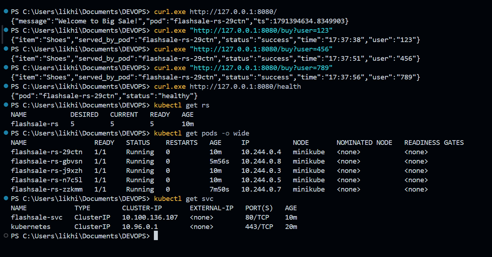
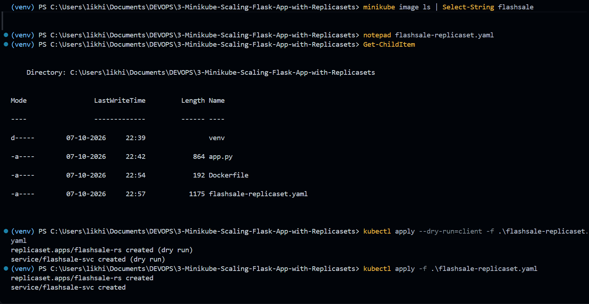
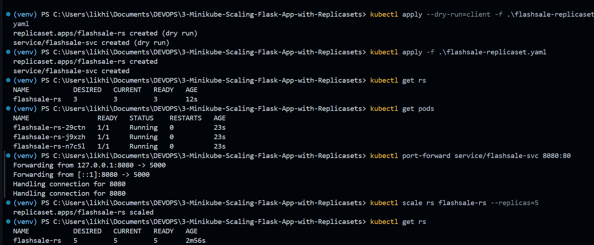
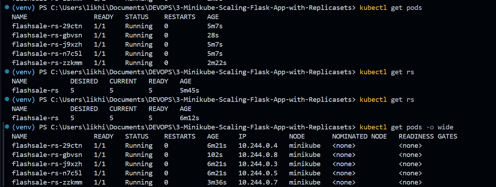

# Exercise 3 – Scaling Flask App on a Single Node Using ReplicaSets

## Objective

Understand Kubernetes ReplicaSets by deploying a Flask application, scaling the application from 3 Pods to 5 Pods, observing Pod replacement, and verifying that all Pods run on a single Minikube node.

This exercise demonstrates how Kubernetes maintains the desired number of application replicas and automatically replaces Pods when one fails or is deleted.

---

## Real-Life Tech Use Case – E-Commerce Flash Sale

During a flash sale on an e-commerce platform such as Flipkart Big Billion Days or Amazon Prime Day, application traffic can increase dramatically.

For example, a Flask service that normally handles around 100 requests per minute may suddenly receive 10,000 requests per minute.

If the application runs on only one Pod, the Pod may become overloaded and fail under the increased traffic.

Using ReplicaSets, multiple identical Pods can be created to handle the increased load. For example:

```text
Normal Traffic
      ↓
  1 Pod

High Traffic
      ↓
  5 / 10 / 20 Pods
```

Once the traffic decreases, the number of replicas can be reduced to save resources.

---

## Environment

- OS: Windows 11
- Minikube: v1.39.0
- Kubernetes: v1.37.0
- Container Runtime: Docker
- Kubernetes Driver: Docker
- Application: Python Flask
- Application Port: 5000
- Initial Replicas: 3
- Scaled Replicas: 5
- Kubernetes Resource: ReplicaSet
- Service Type: ClusterIP
- Nodes: 1

---

## Project Structure

```text
3-Minikube-Scaling-Flask-App-with-Replicasets/
│
├── app.py
├── Dockerfile
├── flashsale-replicaset.yaml
├── README.md
├── venv/
│
└── Images/
    ├── ex3-01-application-tests.png
    ├── ex3-02-final-pods-and-replicaset.png
    ├── ex3-03-yaml-and-deployment.png
    └── ex3-04-scaling-replicaset.png
```

---

# 1. Create the Flask Flash Sale Application

A Flask application was created to simulate an e-commerce flash sale service.

The application provides three endpoints:

- `/` – Displays a welcome message and the hostname of the Pod serving the request.
- `/buy` – Simulates a product purchase and shows which Pod handled the request.
- `/health` – Provides a health status endpoint used by Kubernetes readiness and liveness probes.

### `app.py`

```python
from flask import Flask, request
import socket
import time
import random

app = Flask(__name__)

@app.get("/")
def homepage():
    return {
        "message": "Welcome to Big Sale!",
        "pod": socket.gethostname(),
        "ts": time.time()
    }

@app.get("/buy")
def buy():
    item = random.choice(
        ["Smartphone", "Shoes", "Headphones", "Laptop"]
    )

    user = request.args.get(
        "user",
        f"user{random.randint(1, 1000)}"
    )

    return {
        "status": "success",
        "item": item,
        "user": user,
        "served_by_pod": socket.gethostname(),
        "time": time.strftime("%H:%M:%S")
    }

@app.get("/health")
def health():
    return {
        "status": "healthy",
        "pod": socket.gethostname()
    }
```

The `socket.gethostname()` value is returned so that the Pod serving each request can be identified.

This makes it possible to observe which replica handled a request.

---

# 2. Dockerize the Flask Application

A Dockerfile was created to package the Flask application into a container image.

### `Dockerfile`

```dockerfile
FROM python:3.11-slim

WORKDIR /app

COPY app.py .

RUN pip install --no-cache-dir flask gunicorn

CMD ["gunicorn", "-b", "0.0.0.0:5000", "app:app", "--workers", "1", "--threads", "2"]
```

The Dockerfile:

1. Uses Python 3.11 slim as the base image.
2. Creates `/app` as the working directory.
3. Copies the Flask application.
4. Installs Flask and Gunicorn.
5. Starts the Flask application using Gunicorn.
6. Exposes the application on port `5000`.

---

# 3. Build and Push the Docker Image

The Flask application was built into a Docker image.

### Build Command

Replace `<your-dockerhub-username>` with the Docker Hub username:

```powershell
docker build -t <your-dockerhub-username>/flashsale:1.0 .
```

The Docker image can then be pushed to Docker Hub using:

```powershell
docker push <your-dockerhub-username>/flashsale:1.0
```

The image version used by the ReplicaSet is:

```text
flashsale:1.0
```

---

# 4. Clean Up the Previous Minikube Cluster

Before starting this exercise, the previous Minikube cluster was removed so that the exercise could start with a clean environment.

### Commands

```powershell
minikube stop
```

```powershell
minikube delete
```

This removes the previous local Minikube cluster.

---

# 5. Start Minikube with a Single Node

A new Minikube cluster was started with one node.

### Command

```powershell
minikube start --nodes=1
```

The cluster was configured with a single control-plane node.

The node was verified using:

```powershell
kubectl get nodes
```

Expected output:

```text
NAME       STATUS   ROLES           AGE   VERSION
minikube   Ready    control-plane   ...   ...
```

The cluster contained one node:

```text
minikube
```

### Screenshot



---

# 6. Create the ReplicaSet and Service YAML

A Kubernetes configuration file named:

```text
flashsale-replicaset.yaml
```

was created.

The configuration contains both a ReplicaSet and a ClusterIP Service.

### ReplicaSet Configuration

```yaml
apiVersion: apps/v1
kind: ReplicaSet
metadata:
  name: flashsale-rs
  labels:
    app: flashsale
spec:
  replicas: 3
  selector:
    matchLabels:
      app: flashsale
  template:
    metadata:
      labels:
        app: flashsale
    spec:
      containers:
        - name: flashsale-container
          image: flashsale:1.0
          ports:
            - containerPort: 5000

          readinessProbe:
            httpGet:
              path: /health
              port: 5000
            initialDelaySeconds: 2
            periodSeconds: 5

          livenessProbe:
            httpGet:
              path: /health
              port: 5000
            initialDelaySeconds: 10
            periodSeconds: 10

          resources:
            requests:
              cpu: "100m"
              memory: "128Mi"
            limits:
              cpu: "500m"
              memory: "256Mi"

---
apiVersion: v1
kind: Service
metadata:
  name: flashsale-svc
spec:
  selector:
    app: flashsale
  ports:
    - name: http
      port: 80
      targetPort: 5000
  type: ClusterIP
```

---

# 7. Understanding the ReplicaSet Configuration

The ReplicaSet is configured with:

```yaml
replicas: 3
```

This means Kubernetes should maintain exactly three Pods for the `flashsale` application.

The selector:

```yaml
selector:
  matchLabels:
    app: flashsale
```

matches Pods containing the label:

```yaml
app: flashsale
```

The ReplicaSet therefore manages all Pods with this label.

The container runs:

```text
flashsale:1.0
```

on port:

```text
5000
```

---

# 8. Readiness and Liveness Probes

The application provides a health endpoint:

```text
/health
```

Kubernetes uses this endpoint for health checks.

### Readiness Probe

```yaml
readinessProbe:
  httpGet:
    path: /health
    port: 5000
```

The readiness probe determines whether the Pod is ready to receive traffic.

### Liveness Probe

```yaml
livenessProbe:
  httpGet:
    path: /health
    port: 5000
```

The liveness probe helps Kubernetes determine whether the application is still running correctly.

If a container becomes unhealthy, Kubernetes can restart it.

---

# 9. Apply the ReplicaSet Configuration

The ReplicaSet and Service were deployed using:

```powershell
kubectl apply -f flashsale-replicaset.yaml
```

Expected output:

```text
replicaset.apps/flashsale-rs created
service/flashsale-svc created
```

This creates:

```text
ReplicaSet
    ↓
3 Flask Pods

Service
    ↓
Routes traffic to Flask Pods
```

### Screenshot



---

# 10. Verify the Pods

The Pods created by the ReplicaSet were checked using:

```powershell
kubectl get pods
```

The initial deployment creates three Pods.

Example:

```text
NAME                 READY   STATUS    RESTARTS   AGE
flashsale-rs-xxxxx   1/1     Running   0          ...
flashsale-rs-yyyyy   1/1     Running   0          ...
flashsale-rs-zzzzz   1/1     Running   0          ...
```

The important values are:

```text
READY   1/1
STATUS  Running
```

This confirms that all three Pods are healthy and running.

---

# 11. Verify the ReplicaSet

The ReplicaSet was checked using:

```powershell
kubectl get rs
```

The initial desired state is:

```text
DESIRED   CURRENT   READY
3         3         3
```

This means:

- 3 Pods are desired.
- 3 Pods currently exist.
- 3 Pods are ready.

---

# 12. Scale the ReplicaSet to 5 Pods

The ReplicaSet was scaled from 3 replicas to 5 replicas.

### Command

```powershell
kubectl scale rs flashsale-rs --replicas=5
```

Kubernetes creates two additional Pods to reach the desired number of five replicas.

The desired state becomes:

```text
5 Pods
```

---

# 13. Verify the Scaled ReplicaSet

The ReplicaSet was checked again using:

```powershell
kubectl get rs
```

The expected state is:

```text
NAME          DESIRED   CURRENT   READY
flashsale-rs  5         5         5
```

This confirms that the ReplicaSet successfully scaled the application from three Pods to five Pods.

### Screenshot



---

# 14. Verify the Five Pods

The Pods were checked using:

```powershell
kubectl get pods
```

Five Pods should be present:

```text
NAME                 READY   STATUS    RESTARTS   AGE
flashsale-rs-xxxxx   1/1     Running   0          ...
flashsale-rs-yyyyy   1/1     Running   0          ...
flashsale-rs-zzzzz   1/1     Running   0          ...
flashsale-rs-aaaaa   1/1     Running   0          ...
flashsale-rs-bbbbb   1/1     Running   0          ...
```

All five Pods should have:

```text
READY   1/1
STATUS  Running
```

---

# 15. Delete One Pod

To demonstrate the self-healing behavior of the ReplicaSet, one Pod was manually deleted.

### Command

```powershell
kubectl delete pod <POD_NAME>
```

For example:

```powershell
kubectl delete pod flashsale-rs-84v7x
```

The Pod was successfully deleted.

---

# 16. Verify ReplicaSet Self-Healing

The Pods were checked again:

```powershell
kubectl get pods
```

Although one Pod was deleted, the ReplicaSet automatically created a replacement Pod.

The total number of running Pods returned to:

```text
5
```

This demonstrates the self-healing property of a ReplicaSet.

The ReplicaSet continuously compares the actual number of Pods with the desired number.

```text
Desired Pods = 5
Actual Pods  = 4

        ↓

ReplicaSet creates a new Pod

        ↓

Desired Pods = 5
Actual Pods  = 5
```

---

# 17. View Pod Distribution Across Nodes

Pod distribution was inspected using:

```powershell
kubectl get pods -o wide
```

The output shows the IP address and node for every Pod.

Example:

```text
NAME                 READY   STATUS    IP            NODE
flashsale-rs-xxxxx   1/1     Running   10.244.0.9    minikube
flashsale-rs-yyyyy   1/1     Running   10.244.0.10   minikube
flashsale-rs-zzzzz   1/1     Running   10.244.0.11   minikube
flashsale-rs-aaaaa   1/1     Running   10.244.0.12   minikube
flashsale-rs-bbbbb   1/1     Running   10.244.0.13   minikube
```

Since Minikube was configured with a single node, all five Pods ran on:

```text
minikube
```

### Screenshot



---

# 18. Test the Flask Application

The Flask application provides the following endpoints:

### Home

```text
/
```

Returns a welcome message and the hostname of the Pod that handled the request.

### Buy

```text
/buy
```

Simulates a flash-sale checkout.

Example:

```text
/buy?user=123
```

The response contains:

- Purchase status
- Product
- User
- Pod serving the request
- Time of request

### Health

```text
/health
```

Returns the health status of the application.

The hostname displayed in the responses can be used to identify which Pod processed a request.

### Screenshot


---

# 19. Kubernetes Architecture

The architecture of this exercise is:

```text
                         Client
                           |
                           v
                    flashsale-svc
                      ClusterIP
                           |
            +--------------+--------------+
            |              |              |
            v              v              v
         Pod 1           Pod 2          Pod 3
            |              |              |
            +--------------+--------------+
                           |
                    ReplicaSet
                  Desired = 5
                           |
            +--------------+--------------+
            |              |              |
            v              v              v
         Pod 4           Pod 5       Replacement Pod
```

The application is running on a single Minikube node:

```text
                Minikube Cluster
                       |
                       v
                 Node: minikube
                       |
        +--------------+--------------+
        |      |       |      |       |
       Pod    Pod     Pod    Pod     Pod
        1      2       3      4       5
```

---

# 20. ReplicaSet Scaling Flow

The scaling process can be summarized as:

```text
Initial State
    |
    v
ReplicaSet = 3
    |
    v
3 Running Pods
    |
    | kubectl scale --replicas=5
    v
ReplicaSet = 5
    |
    v
5 Running Pods
    |
    | Delete one Pod
    v
4 Running Pods
    |
    v
ReplicaSet detects mismatch
    |
    v
Creates replacement Pod
    |
    v
5 Running Pods
```

---

# 21. Key Observations and Learnings

### Pod Distribution

Each Pod acts as an identical worker running the same Flask application.

Scaling means increasing the number of identical application instances.

### Resiliency

If one Pod is deleted or fails, the ReplicaSet automatically creates another Pod.

This helps maintain the desired application capacity.

### Efficiency

Instead of permanently maintaining a large number of application instances, replicas can be increased when demand increases and reduced when demand decreases.

### Scalability in Real-World Systems

The same basic scaling concept is used by large distributed applications and microservice platforms to handle increases in traffic.

---

# 22. Commands Used

### Start Minikube

```powershell
minikube start --nodes=1
```

### Check Nodes

```powershell
kubectl get nodes
```

### Apply ReplicaSet

```powershell
kubectl apply -f flashsale-replicaset.yaml
```

### Check Pods

```powershell
kubectl get pods
```

### Check ReplicaSet

```powershell
kubectl get rs
```

### Scale ReplicaSet

```powershell
kubectl scale rs flashsale-rs --replicas=5
```

### Delete Pod

```powershell
kubectl delete pod <POD_NAME>
```

### View Pod Distribution

```powershell
kubectl get pods -o wide
```

### View ReplicaSet Details

```powershell
kubectl describe rs flashsale-rs
```

### View Pod Logs

```powershell
kubectl logs <POD_NAME>
```

---

# 23. What I Learned

Through this exercise, I learned:

- What a Kubernetes ReplicaSet is.
- How ReplicaSets maintain a desired number of Pods.
- How to create a ReplicaSet using YAML.
- How to scale a ReplicaSet using `kubectl scale`.
- How scaling from 3 to 5 replicas creates additional Pods.
- How Kubernetes automatically replaces a deleted Pod.
- How ReplicaSets provide basic self-healing behavior.
- How to check the number of desired, current, and ready replicas.
- How to inspect Pod distribution using `kubectl get pods -o wide`.
- How a Service provides access to multiple Pods.
- How health probes can be used to monitor application health.
- How multiple identical Pods can improve application resiliency.
- How horizontal scaling can help an application handle increased traffic.

---

# 24. Q&A

### Q1. What is the initial number of replicas in the ReplicaSet?

**Answer:** 3 replicas.

---

### Q2. How many Pods are running after applying the ReplicaSet configuration?

**Answer:** 3 Pods.

---

### Q3. What happens when the ReplicaSet is scaled to 5 replicas?

**Answer:** Kubernetes creates two additional Pods so that the total number of replicas becomes 5.

---

### Q4. What happens when one Pod is deleted?

**Answer:** The ReplicaSet detects that the actual number of Pods is lower than the desired number and automatically creates a replacement Pod.

---

### Q5. How does Kubernetes maintain the desired number of replicas?

**Answer:** The ReplicaSet continuously compares the desired number of replicas with the actual number of running Pods. If there is a difference, it creates or removes Pods to reach the desired state.

---

### Q6. How many nodes are running?

**Answer:** 1 node.

The node is:

```text
minikube
```

---

### Q7. Where are the Pods running?

**Answer:** Since the cluster contains a single node, all five Pods are running on the same node:

```text
Node: minikube

Pod 1
Pod 2
Pod 3
Pod 4
Pod 5
```

---

# 25. Result

The Flask flash-sale application was successfully deployed on a single-node Minikube Kubernetes cluster using a ReplicaSet.

The application was initially deployed with 3 replicas and successfully scaled to 5 replicas.

When one Pod was manually deleted, the ReplicaSet automatically created a replacement Pod and restored the desired replica count to 5.

The final deployment demonstrated:

```text
3 replicas
    ↓
Scale to 5 replicas
    ↓
5 running Pods
    ↓
Delete one Pod
    ↓
ReplicaSet creates replacement
    ↓
5 running Pods
```

The exercise successfully demonstrated **ReplicaSet scaling, Pod management, self-healing, and single-node Pod distribution in Kubernetes**.