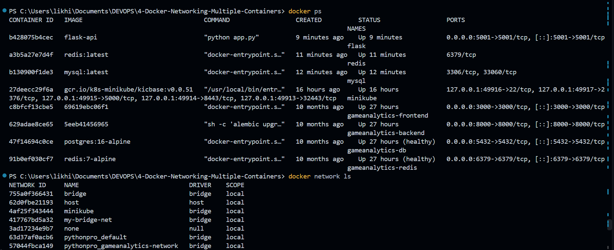
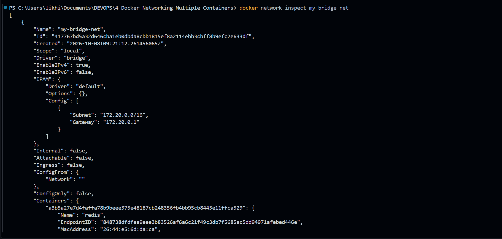
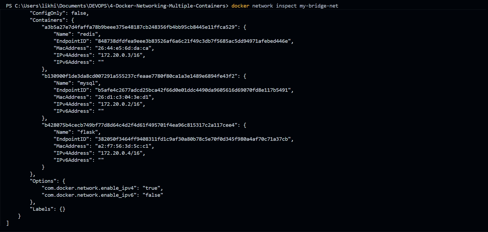

# Exercise 4 – Docker Networking with Multiple Containers

## Objective

Understand Docker networking concepts and configure a multi-container application using a custom Docker bridge network.

This exercise demonstrates how multiple containers can communicate with each other using Docker's user-defined bridge network and container names.

---

## Scenario

A simple multi-container web application was created consisting of:

- **Flask** – Python REST API
- **MySQL** – Database container
- **Redis** – Cache container

All three containers were connected to the same custom Docker bridge network.

The architecture is:

```text
                    Docker Network
                    my-bridge-net
                         |
          +--------------+--------------+
          |              |              |
          v              v              v
       Flask           MySQL          Redis
      Container       Container      Container
          |
       Port 5001
          |
          v
       Host Machine
```

---

## Environment

- OS: Windows 11
- Container Runtime: Docker Desktop
- Network Driver: Bridge
- Custom Network: `my-bridge-net`
- Flask Application Port: `5001`
- MySQL Container: `mysql`
- Redis Container: `redis`
- Flask Container: `flask`

---

# 1. Create a Docker Bridge Network

A custom Docker bridge network was created to allow the containers to communicate with each other.

### Command

```powershell
docker network create --driver bridge my-bridge-net
```

The custom network created was:

```text
my-bridge-net
```

A user-defined bridge network provides network isolation while allowing containers attached to the same network to communicate with each other.

---

# 2. Verify the Docker Network

The available Docker networks were checked using:

```powershell
docker network ls
```

The custom network appeared with the following configuration:

```text
NAME            DRIVER    SCOPE
my-bridge-net   bridge    local
```

The network uses the Docker `bridge` driver and has a local scope.

### Screenshot



---

# 3. Inspect the Docker Network

The configuration of the custom network was inspected using:

```powershell
docker network inspect my-bridge-net
```

The inspected network had the following configuration:

```text
Name:       my-bridge-net
Driver:     bridge
Scope:      local
IPv4:       enabled
IPv6:       disabled
```

The network used the following subnet and gateway in the completed setup:

```text
Subnet:    172.20.0.0/16
Gateway:   172.20.0.1
```

The network inspection also showed the containers attached to the network.

### Screenshot



---

# 4. Create the Flask Application

A simple REST API was created using Flask.

### `app.py`

```python
from flask import Flask, jsonify

app = Flask(__name__)

@app.route('/about', methods=['GET'])
def about():
    return jsonify({
        "name": "Simple REST API",
        "version": "1.0",
        "description": "This is a simple REST API built with Flask."
    })

if __name__ == '__main__':
    app.run(debug=True, host='0.0.0.0', port=5001)
```

The `/about` endpoint returns information about the REST API.

The Flask application runs on:

```text
0.0.0.0:5001
```

---

# 5. Create the Requirements File

The Flask dependency was specified in:

```text
requirements.txt
```

### `requirements.txt`

```text
Flask==2.0.1
```

---

# 6. Create the Dockerfile

A Dockerfile was created to build the Flask application image.

### `Dockerfile`

```dockerfile
FROM python:3.9-slim

WORKDIR /app

COPY requirements.txt .
COPY app.py .

RUN pip install --no-cache-dir -r requirements.txt

EXPOSE 5001

CMD ["python", "app.py"]
```

The Dockerfile performs the following steps:

1. Uses Python 3.9 slim as the base image.
2. Creates `/app` as the working directory.
3. Copies the requirements file.
4. Copies the Flask application.
5. Installs Flask.
6. Exposes port `5001`.
7. Starts the Flask application.

---

# 7. Build the Flask Docker Image

The Flask Docker image was built using:

```powershell
docker build -t flask-api .
```

This created the Docker image:

```text
flask-api
```

The image contains the Flask REST API and its dependencies.

---

# 8. Launch the MySQL, Redis, and Flask Containers

Three containers were created and connected to the custom bridge network.

### MySQL

```powershell
docker run -d --name mysql --net=my-bridge-net mysql:latest
```

### Redis

```powershell
docker run -d --name redis --net=my-bridge-net redis:latest
```

### Flask

```powershell
docker run -d --name flask --net=my-bridge-net -p 5001:5001 flask-api
```

The `-d` option runs each container in detached mode.

The `--net=my-bridge-net` option connects each container to the custom Docker network.

The `-p 5001:5001` option maps the Flask container's port `5001` to port `5001` on the host machine.

---

# 9. Verify Running Containers

The running Docker containers were checked using:

```powershell
docker ps
```

The completed setup contained:

```text
flask
redis
mysql
```

The Flask container exposed:

```text
0.0.0.0:5001 -> 5001/tcp
```

Redis was running on its default container port:

```text
6379/tcp
```

MySQL was running on:

```text
3306/tcp
```

### Screenshot


---

# 10. Docker Network Connectivity

All three application containers were connected to:

```text
my-bridge-net
```

Docker assigned each container an IP address on the custom bridge network.

The completed network inspection showed:

```text
redis   -> 172.20.0.3
mysql   -> 172.20.0.2
flask   -> 172.20.0.4
```

This demonstrates that the containers are connected to the same Docker network.

### Screenshot



---

# 11. Container-to-Container Communication

Containers attached to the same user-defined bridge network can communicate using their container names.

For example:

```text
flask → mysql
flask → redis
```

Instead of manually using the container IP address, Docker's embedded DNS allows the container names to be resolved.

Therefore, the Flask container can reach:

```text
mysql
```

and:

```text
redis
```

using their container names.

---

# 12. Test Connectivity from the Flask Container

A shell can be opened inside the Flask container using:

```powershell
docker exec -it flask bash
```

From inside the Flask container, connectivity to MySQL can be tested using:

```bash
ping mysql
```

Connectivity to Redis can be tested using:

```bash
ping redis
```

Successful responses confirm that the Flask container can reach the other containers through the custom Docker bridge network.

The network inspection also confirms that Flask, MySQL, and Redis are attached to the same network.

---

# 13. Access the Flask REST API

The Flask application was exposed to the host using:

```text
-p 5001:5001
```

This creates the following mapping:

```text
Host Port 5001
      ↓
Container Port 5001
      ↓
Flask Application
```

The REST API can therefore be accessed from the host using:

```text
http://127.0.0.1:5001/about
```

The `/about` endpoint returns:

```json
{
  "name": "Simple REST API",
  "version": "1.0",
  "description": "This is a simple REST API built with Flask."
}
```

---

# 14. How Docker Container Networking Works

The completed setup can be represented as:

```text
                         Host Machine
                              |
                         Port 5001
                              |
                              v
                         Flask Container
                         IP: 172.20.0.4
                              |
                  +-----------+-----------+
                  |                       |
                  v                       v
             MySQL Container        Redis Container
             IP: 172.20.0.2          IP: 172.20.0.3
                  |                       |
                  +-----------+-----------+
                              |
                              v
                       my-bridge-net
                         172.20.0.0/16
```

The Flask application communicates with MySQL and Redis through the same Docker network.

---

# 15. Docker Bridge Network

A Docker bridge network provides an isolated virtual network for containers.

The custom bridge network created in this exercise was:

```text
my-bridge-net
```

Its configuration included:

```text
Driver:     bridge
Scope:      local
Subnet:     172.20.0.0/16
Gateway:    172.20.0.1
```

Containers connected to the network receive IP addresses from this subnet.

---

# 16. `--net` Option

The `--net` option in `docker run` specifies which Docker network a container should connect to.

For example:

```powershell
docker run -d --name flask --net=my-bridge-net -p 5001:5001 flask-api
```

Here:

```text
--net=my-bridge-net
```

connects the Flask container to the custom Docker network.

The same was done for MySQL and Redis.

---

# 17. Bridge Network vs Host Network

### Bridge Network

With a bridge network:

```text
Container
   ↓
Docker Bridge Network
   ↓
Other Containers
```

Containers have their own network namespace and communicate through the Docker network.

### Host Network

With a host network, the container shares the host's network stack.

The basic difference is:

```text
Bridge Network
→ Containers use an isolated Docker network.

Host Network
→ Containers share the host's network stack.
```

A simple analogy is:

```text
Bridge Network:
Containers are in a private room and communicate through the room's network.

Host Network:
Containers are directly connected to the host's network.
```

---

# 18. Port Mapping

A container's port can be exposed to the host using the `-p` option.

For the Flask application:

```powershell
docker run -d --name flask --net=my-bridge-net -p 5001:5001 flask-api
```

The mapping is:

```text
Host Port 5001
      ↓
Container Port 5001
```

This allows applications outside the container network to access the Flask API.

---

# 19. Network Inspection

The following command was used to inspect the complete Docker network configuration:

```powershell
docker network inspect my-bridge-net
```

The inspection showed:

- Network name
- Network ID
- Network driver
- IPv4 configuration
- Subnet
- Gateway
- Connected containers
- Container IP addresses
- MAC addresses

### Screenshot


---

# 20. Cleanup

After completing the exercise, the containers can be stopped and removed using:

```powershell
docker stop mysql redis flask
```

Then remove them:

```powershell
docker rm mysql redis flask
```

The custom Docker network can be removed using:

```powershell
docker network rm my-bridge-net
```

The network is removed only after all attached containers have been stopped and removed.

---

# 21. Questions and Answers

### Q1. What is the purpose of the `--net` flag in `docker run`?

The `--net` flag specifies the Docker network to which the container should be connected.

Example:

```powershell
--net=my-bridge-net
```

This connects the container to the custom bridge network.

---

### Q2. How do containers communicate with each other on the same network?

Containers connected to the same user-defined Docker bridge network can communicate with each other using container names or IP addresses.

For example:

```text
flask → mysql
flask → redis
```

Docker's internal DNS resolves the container names to their corresponding IP addresses.

---

### Q3. What is the difference between a bridge network and a host network?

A **bridge network** provides an isolated virtual network for containers.

A **host network** allows containers to share the host machine's network stack.

In simple terms:

```text
Bridge Network → Isolated container networking

Host Network → Shared host networking
```

---

### Q4. How can you expose a container's port to the host machine?

The `-p` option is used to map a host port to a container port.

Example:

```powershell
-p 5001:5001
```

This means:

```text
Host Port 5001
      ↓
Container Port 5001
```

---

# 22. Key Observations and Learnings

Through this exercise, I learned:

- How to create a custom Docker bridge network.
- How to inspect Docker network configuration.
- How to connect multiple containers to the same network.
- How Docker assigns IP addresses to connected containers.
- How containers communicate using container names.
- How Docker's internal DNS helps resolve container names.
- How to run Flask, MySQL, and Redis as separate containers.
- How to expose a container port using Docker port mapping.
- The difference between bridge and host networking.
- How to inspect connected containers using `docker network inspect`.
- How multi-container applications can communicate through a shared Docker network.

---

# 23. Result

A multi-container Docker application was successfully configured using a custom bridge network named:

```text
my-bridge-net
```

The application consisted of:

```text
Flask
MySQL
Redis
```

All three containers were connected to the same Docker bridge network and received IP addresses from the same subnet.

The Flask application was exposed on host port `5001`, while the Flask container successfully shared the Docker network with MySQL and Redis.

The exercise successfully demonstrated **Docker bridge networking, container-to-container communication, network inspection, and host-to-container port mapping**.