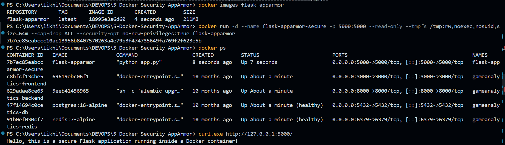
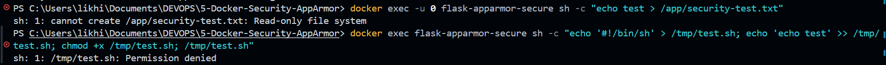
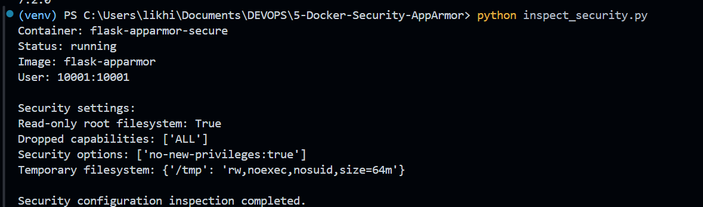
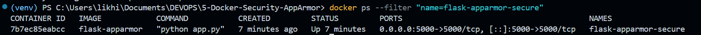

# Exercise 5 – Docker Security with AppArmor and Python

## Objective

The objective of this exercise is to understand Docker container security and learn how to restrict container capabilities, prevent unauthorized filesystem modifications, and inspect container security settings using the Docker SDK for Python.

The exercise uses a Python Flask application running inside a Docker container. Docker security controls are applied to reduce the container's privileges and restrict potentially dangerous operations.

The practical demonstrates:

- Containerizing a Flask application using Docker.
- Running the application as a non-root user.
- Restricting writes using a read-only root filesystem.
- Preventing execution of scripts from a restricted temporary filesystem.
- Dropping Linux capabilities.
- Preventing privilege escalation.
- Inspecting security configuration using the Docker SDK for Python.
- Testing restricted actions and verifying that they are blocked.

---

## Environment Limitation

The original exercise requires loading a custom AppArmor profile using `apparmor_parser` and applying it with Docker's `security_opt` option.

The practical was performed on Windows using Docker Desktop with its WSL2 backend. The following command was used to inspect the available Docker security options:

```powershell
docker info --format '{{json .SecurityOptions}}'
```

The output was:

```text
["name=seccomp,profile=builtin","name=cgroupns"]
```

This environment did not expose AppArmor support, so a custom AppArmor profile could not be loaded or applied.

Instead, this implementation demonstrates Docker's supported security controls: a read-only root filesystem, dropped Linux capabilities, `no-new-privileges`, a non-root user, and a `noexec` temporary filesystem. These controls were tested successfully.

**Note:** This practical demonstrates Docker container hardening, but the custom AppArmor-specific part of the original assignment remains unimplemented in this environment.

---

## Technologies Used

- Python 3.11
- Flask 3.1.3
- Docker Desktop
- Docker Engine
- Docker SDK for Python
- PowerShell
- WSL2

---

## Project Structure

```text
5-Docker-Security-AppArmor/
│
├── app.py
├── requirements.txt
├── Dockerfile
├── inspect_security.py
├── test_restricted_actions.py
├── README.md
├── .gitignore
├── venv/
│
└── Images/
    ├── ex5-01-flask-application.png
    ├── ex5-02-restricted-actions.png
    ├── ex5-03-container-security-settings.png
    └── ex5-04-running-container.png
```

The `venv/` directory contains the local Python virtual environment and should not be committed to GitHub.

---

## Task 1: Create the Flask Application

Create a file named `app.py`.

### `app.py`

```python
from flask import Flask

app = Flask(__name__)

@app.route('/')
def home():
    return "Hello, this is a secure Flask application running inside a Docker container!"

if __name__ == '__main__':
    app.run(host='0.0.0.0', port=5000)
```

The application exposes the `/` endpoint, which returns a confirmation message when accessed.

The application listens on port `5000` and is accessible through Docker's port mapping.

---

## Task 2: Create the Requirements File

Create a file named `requirements.txt`.

### `requirements.txt`

```text
Flask==3.1.3
```

This specifies the Flask version installed in the container image.

---

## Task 3: Create the Dockerfile

Create a file named `Dockerfile`.

### `Dockerfile`

```dockerfile
FROM python:3.11-slim

WORKDIR /app

COPY requirements.txt .
RUN pip install --no-cache-dir -r requirements.txt

COPY app.py .

RUN useradd --uid 10001 --create-home appuser

USER 10001:10001

EXPOSE 5000

CMD ["python", "app.py"]
```

### Explanation

- `FROM python:3.11-slim` uses a lightweight Python base image.
- `WORKDIR /app` sets the working directory.
- `COPY` copies the application and dependency file into the image.
- `RUN pip install` installs Flask.
- `RUN useradd` creates a dedicated application user.
- `USER 10001:10001` runs the application as a non-root user.
- `EXPOSE 5000` documents the application port.
- `CMD` starts the Flask application.

Running the application as a non-root user reduces the privileges available to the application process.

---

## Task 4: Build the Docker Image

Open PowerShell in the project directory.

Build the Docker image:

```powershell
docker build -t flask-apparmor .
```

Verify the image:

```powershell
docker images flask-apparmor
```

The image was successfully created.

### Output

```text
REPOSITORY       TAG       IMAGE ID       SIZE
flask-apparmor   latest    18995e3a6d60   211MB
```

The image is named `flask-apparmor` to match the original assignment.

---

## Task 5: Run the Container with Security Restrictions

Start the Flask container with Docker security controls:

```powershell
docker run -d --name flask-apparmor-secure -p 5000:5000 --read-only --tmpfs /tmp:rw,noexec,nosuid,size=64m --cap-drop ALL --security-opt no-new-privileges:true flask-apparmor
```

The options used are described below.

| Docker option | Purpose |
|---|---|
| `-d` | Runs the container in detached mode. |
| `--name flask-apparmor-secure` | Assigns a name to the container. |
| `-p 5000:5000` | Maps host port 5000 to container port 5000. |
| `--read-only` | Makes the container's root filesystem read-only. |
| `--tmpfs /tmp:rw,noexec,nosuid,size=64m` | Provides temporary storage while preventing execution from `/tmp` and disallowing set-user-ID/set-group-ID execution semantics. |
| `--cap-drop ALL` | Drops all Linux capabilities from the container. |
| `--security-opt no-new-privileges:true` | Prevents processes from gaining additional privileges through execution. |

The application uses port `5000`, which does not require the privileged-port binding capability.

### Verify the Container

Run:

```powershell
docker ps
```

The container appeared with status `Up` and port mapping `5000:5000`.

---

## Task 6: Test the Flask Application

Run:

```powershell
curl.exe http://127.0.0.1:5000/
```

### Actual Output

```text
Hello, this is a secure Flask application running inside a Docker container!
```

This confirms that the Flask application remains functional after applying the security restrictions.

### Screenshot 1 — Flask Application



---

## Task 7: Test Restricted Filesystem Writes

The container was started with the `--read-only` option.

To test the restriction, attempt to write a file to `/app`:

```powershell
docker exec -u 0 flask-apparmor-secure sh -c "echo test > /app/security-test.txt"
```

### Actual Output

```text
sh: 1: cannot create /app/security-test.txt: Read-only file system
```

The command failed because the container's root filesystem is read-only.

The test uses the container's root user to show that the restriction comes from the filesystem mount rather than only from ordinary user permissions.

**Observation:** The root filesystem is protected against writes, even when the command runs as root.

---

## Task 8: Test the No-Execute Restriction

The `/tmp` directory was mounted with the `noexec` option.

Create a small shell script and attempt to execute it:

```powershell
docker exec flask-apparmor-secure sh -c "echo '#!/bin/sh' > /tmp/test.sh; echo 'echo test' >> /tmp/test.sh; chmod +x /tmp/test.sh; /tmp/test.sh"
```

### Actual Output

```text
sh: 1: /tmp/test.sh: Permission denied
```

The execution attempt was denied because `/tmp` was mounted with `noexec`.

**Observation:** A script created in the restricted temporary filesystem could not be executed directly.

### Screenshot 2 — Restricted Actions



---

## Task 9: Install the Docker SDK for Python

A Python virtual environment was created to isolate the project's dependencies.

Create the environment:

```powershell
python -m venv venv
```

Activate it:

```powershell
.\venv\Scripts\Activate.ps1
```

Install the Docker SDK:

```powershell
python -m pip install docker
```

Verify the installation:

```powershell
python -c "import docker; print(docker.__version__)"
```

### Installed Version

```text
7.2.0
```

The Docker SDK allows Python programs to inspect and manage containers through the Docker Engine API.

---

## Task 10: Inspect Container Security Settings Using Python

Create a file named `inspect_security.py`.

### `inspect_security.py`

```python
import docker

client = docker.from_env()

container = client.containers.get("flask-apparmor-secure")
container.reload()

info = container.attrs
host_config = info["HostConfig"]

print("Container:", container.name)
print("Status:", info["State"]["Status"])
print("Image:", info["Config"]["Image"])
print("User:", info["Config"].get("User"))

print("\nSecurity settings:")
print("Read-only root filesystem:", host_config.get("ReadonlyRootfs"))
print("Dropped capabilities:", host_config.get("CapDrop"))
print("Security options:", host_config.get("SecurityOpt"))
print("Temporary filesystem:", host_config.get("Tmpfs"))

print("\nSecurity configuration inspection completed.")
```

Run the script:

```powershell
python inspect_security.py
```

### Actual Output

```text
Container: flask-apparmor-secure
Status: running
Image: flask-apparmor
User: 10001:10001

Security settings:
Read-only root filesystem: True
Dropped capabilities: ['ALL']
Security options: ['no-new-privileges:true']
Temporary filesystem: {'/tmp': 'rw,noexec,nosuid,size=64m'}

Security configuration inspection completed.
```

The output confirms that Docker applied the configured restrictions.

### Observations

- The container is running.
- The application runs as a non-root user.
- The root filesystem is read-only.
- All Linux capabilities were dropped.
- The `no-new-privileges` security option is enabled.
- The temporary filesystem has `noexec` and `nosuid` options.

### Screenshot 3 — Container Security Settings



---

## Task 11: Test Restricted Actions Using the Docker SDK

Create a file named `test_restricted_actions.py`.

### `test_restricted_actions.py`

```python
import docker

# Connect to Docker Desktop
client = docker.from_env()

# Get the running secured container
container = client.containers.get("flask-apparmor-secure")

print(f"Container: {container.name}")
print(f"Status: {container.status}")

tests = [
    (
        "Write to read-only /app",
        [
            "sh",
            "-c",
            "echo test > /app/sdk-security-test.txt"
        ]
    ),
    (
        "Execute a script from noexec /tmp",
        [
            "sh",
            "-c",
            "printf '#!/bin/sh\\necho executed\\n' > /tmp/sdk-noexec-test.sh"
            " && chmod +x /tmp/sdk-noexec-test.sh"
            " && /tmp/sdk-noexec-test.sh"
        ]
    )
]

for description, command in tests:
    result = container.exec_run(command)

    print(f"\nTest: {description}")
    print(f"Exit code: {result.exit_code}")

    output = result.output.decode("utf-8", errors="replace").strip()
    print(f"Output: {output or '(no output)'}")

    if result.exit_code != 0:
        print("Result: RESTRICTION CONFIRMED")
    else:
        print("Result: RESTRICTION NOT CONFIRMED")
```

Run:

```powershell
python test_restricted_actions.py
```

### Actual Output

```text
Container: flask-apparmor-secure
Status: running

Test: Write to read-only /app
Exit code: 2
Output: sh: 1: cannot create /app/sdk-security-test.txt: Read-only file system
Result: RESTRICTION CONFIRMED

Test: Execute a script from noexec /tmp
Exit code: 126
Output: sh: 1: /tmp/sdk-noexec-test.sh: Permission denied
Result: RESTRICTION CONFIRMED
```

Both tests returned nonzero exit codes and the expected restriction messages.

**Conclusion:** The Docker SDK successfully executed the test commands and confirmed that the configured filesystem restrictions were enforced.

---

## Task 12: Verify the Container Is Still Running

Run:

```powershell
docker ps --filter "name=flask-apparmor-secure"
```

### Actual Observation

```text
CONTAINER ID   IMAGE            COMMAND           STATUS
7b7ec85eabcc   flask-apparmor   "python app.py"   Up
```

The Flask container continued running after the restricted-action tests.

### Screenshot 4 — Running Container



---

## Security Controls Demonstrated

| Security control | Verification | Result |
|---|---|---|
| Non-root execution | Docker SDK inspection | User is `10001:10001` |
| Read-only root filesystem | Attempted write to `/app` | Blocked |
| No-execute temporary filesystem | Attempted script execution from `/tmp` | Blocked |
| Drop Linux capabilities | Docker SDK inspection | `ALL` dropped |
| No privilege escalation | Docker SDK inspection | `no-new-privileges:true` |
| Application availability | HTTP request to `/` | Successful |
| Container availability | `docker ps` | Running |

These measures provide multiple layers of container hardening. No single control replaces the others.

---

## Questions and Answers

### Q1. What is the purpose of using AppArmor with Docker containers?

**Answer:** AppArmor provides mandatory access control through security profiles that limit what an application can access or execute. When supported by the Linux host and Docker runtime, profiles provide an additional layer of confinement for containers.

In this practical, a custom AppArmor profile was not applied because the current Docker Desktop environment did not expose AppArmor support. Instead, supported Docker security controls were implemented and tested.

### Q2. How do AppArmor profiles help secure a Docker container?

**Answer:** AppArmor profiles define which resources an application can access and which operations it can perform. Depending on the profile, they can restrict file access, execution, and other application behavior.

This practical demonstrated related container-hardening objectives using Docker's read-only filesystem, Linux capability restrictions, `noexec`, and `no-new-privileges` options.

### Q3. Why is it important to restrict access to sensitive directories such as `/etc/` and `/var/`?

**Answer:** These directories can contain configuration files, logs, service data, and other sensitive resources. Limiting unnecessary access reduces the possibility of unauthorized modification or disclosure.

This practical tested filesystem restrictions on `/app` and execution restrictions on `/tmp`; it did not test a custom policy restricting `/etc/` or `/var/`.

### Q4. What other capabilities can be restricted using AppArmor profiles?

**Answer:** Depending on the policy and application requirements, AppArmor can control file access, execution, network-related operations, and other supported application behaviors. Docker also allows Linux capabilities to be dropped or selectively granted.

In this practical, all Linux capabilities were dropped using `--cap-drop ALL`.

### Q5. How can you verify whether an AppArmor profile is successfully applied to a Docker container?

**Answer:** On a Linux host with AppArmor support, the host's AppArmor status and the container's security configuration should be inspected. Docker inspection can show the requested security options, while Linux host tools can verify profile loading and enforcement.

For example:

```bash
sudo aa-status
```

```bash
docker inspect --format '{{json .HostConfig.SecurityOpt}}' <container-name>
```

This practical inspected the container using the Docker SDK. Its security options showed `no-new-privileges:true`; they did not show a custom AppArmor profile. Therefore, a custom AppArmor profile cannot be claimed as applied in this environment.

---

## Conclusion

This exercise demonstrated practical Docker container-hardening techniques using a Python Flask application and the Docker SDK for Python.

The Flask application was containerized and successfully accessed through port `5000`. The container ran as a non-root user with a read-only root filesystem, all Linux capabilities dropped, `no-new-privileges` enabled, and a temporary filesystem mounted with `noexec` and `nosuid`.

The security tests confirmed that:

- Writing to `/app` was denied.
- Executing a script from `/tmp` was denied.
- The Docker SDK reported the expected security settings.
- The Flask application remained accessible.
- The container remained running after the tests.

The custom AppArmor profile portion remains unimplemented because the current Docker Desktop environment did not expose AppArmor support. The demonstrated Docker security controls provide a practical alternative for learning container hardening, but they are not equivalent to applying a custom AppArmor profile.

---

## Final Result

- [x] Flask application created.
- [x] Docker image `flask-apparmor` built.
- [x] Container started as a non-root user.
- [x] Application tested successfully through port `5000`.
- [x] Read-only root filesystem enabled and tested.
- [x] `/tmp` mounted with `noexec` and `nosuid`.
- [x] All Linux capabilities dropped.
- [x] `no-new-privileges` enabled.
- [x] Docker SDK installed and verified.
- [x] Container security settings inspected using Python.
- [x] Restricted filesystem write tested and blocked.
- [x] Restricted script execution tested and blocked.
- [x] Container verified to be running after testing.
- [ ] Custom AppArmor profile loaded and applied (not supported by the current Docker Desktop environment).