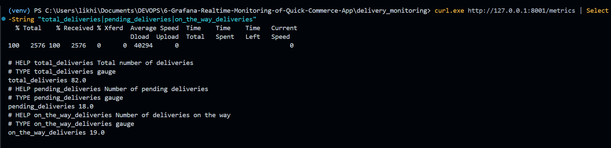
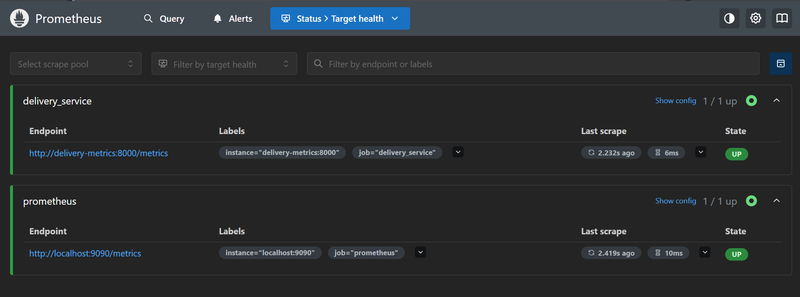
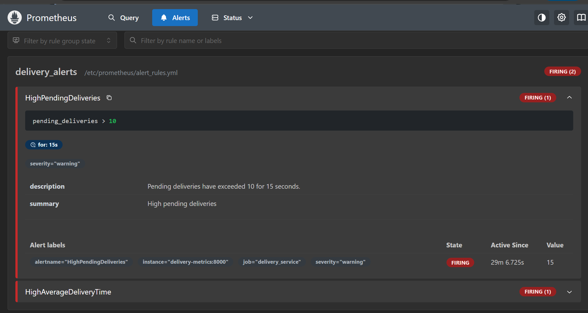
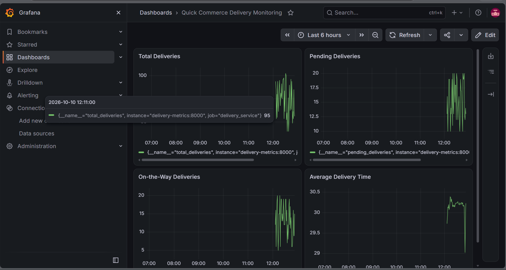
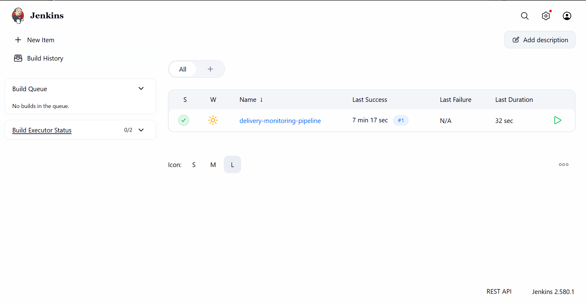
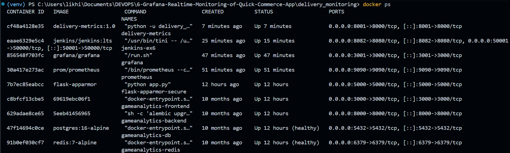

# Exercise 6: Grafana Real-Time Monitoring of a Quick-Commerce Application

## Real-Life Tech Use Case: Quick-Commerce Delivery Monitoring

Imagine working as a DevOps Engineer for ZAPPTTO, a quick-commerce delivery platform responsible for handling orders, delivery assignments, and last-mile delivery operations.

During peak hours, the platform needs real-time insights into operational performance. Monitoring delivery counts, pending orders, delivery status, and delivery time helps identify operational bottlenecks and detect problems quickly.

In this exercise, a Python application simulates delivery metrics. Prometheus collects the metrics, Grafana visualizes them in a dashboard, alert rules identify abnormal delivery conditions, and Jenkins automates the application deployment workflow.

## Objectives

The objectives of this exercise are:

1. Develop a Python application that simulates real-time delivery metrics.
2. Expose application metrics using the Prometheus Python client.
3. Configure Prometheus to scrape metrics from the application.
4. Create Prometheus alert rules for high pending deliveries and high average delivery time.
5. Configure Grafana with Prometheus as a data source.
6. Create a dashboard containing four real-time delivery monitoring panels.
7. Demonstrate alerts when delivery metrics exceed configured thresholds.
8. Create a Jenkins pipeline to build, deploy, and verify the delivery metrics application.
9. Use Docker networking to connect the monitoring components.

---

## Technologies Used

- Python 3.11
- Prometheus
- Grafana
- Jenkins
- Docker Desktop
- Docker CLI
- Prometheus Python Client
- PowerShell
- Docker bridge networking

---

## Project Structure

```text
6-Grafana-Realtime-Monitoring-of-Quick-Commerce-App/
│
├── README.md
├── Images/
│   ├── ex6-01-delivery-metrics.png
│   ├── ex6-02-prometheus-targets.png
│   ├── ex6-03-grafana-dashboard.png
│   ├── ex6-04-prometheus-alerts.png
│   ├── ex6-05-jenkins-pipeline-success.png
│   └── ex6-06-docker-containers.png
│
└── delivery_monitoring/
    ├── delivery_metrics.py
    ├── requirements.txt
    ├── Dockerfile
    ├── prometheus.yml
    ├── alert_rules.yml
    └── Jenkinsfile
```

The `delivery_monitoring` directory contains the application source code, Docker configuration, Prometheus configuration, alert rules, and Jenkins pipeline script.

The `Images` directory contains the screenshots demonstrating the completed practical.

---

## System Architecture

The monitoring system consists of four primary components:

- **Delivery Metrics Exporter:** Simulates delivery operations and exposes application metrics.
- **Prometheus:** Scrapes and stores the metrics, evaluates alert rules, and exposes query results.
- **Grafana:** Connects to Prometheus and visualizes delivery metrics in a dashboard.
- **Jenkins:** Automates building the Docker image, deploying the metrics exporter, and verifying the monitoring stack.

### Architecture Diagram

```text
                   Python Delivery Application
                              |
                              v
                  Prometheus Metrics Exporter
                       Container :8000
                              |
                              v
                     Docker Bridge Network
                    delivery-monitoring-net
                              |
                 +------------+------------+
                 |                         |
                 v                         v
            Prometheus                  Grafana
            Container                  Container
             Port 9090                  Port 3000
                 |                         |
                 |                         |
                 +------------+------------+
                              |
                       Monitoring Dashboard
                              |
                  +-----------+-----------+
                  |                       |
                  v                       v
            Delivery Metrics        Prometheus Alerts

                              Jenkins
                               |
                    Build and Deploy Pipeline
                               |
                               v
                      Delivery Metrics Image
```

### Port Mapping

The following ports were used to avoid conflicts with other applications running on the Windows machine.

| Component | Container Port | Host Port | URL |
|---|---:|---:|---|
| Delivery Metrics Exporter | 8000 | 8001 | `http://localhost:8001/metrics` |
| Prometheus | 9090 | 9090 | `http://localhost:9090` |
| Grafana | 3000 | 3001 | `http://localhost:3001` |
| Jenkins | 8080 | 8082 | `http://localhost:8082` |
| Jenkins Agent Communication | 50000 | 50001 | Internal lab configuration |

All four services were run using Docker containers. The exporter, Prometheus, Grafana, and Jenkins were connected to the dedicated Docker network where needed.

---

# Task 1: Create the Delivery Metrics Application

## Step 1: Create the project directory

Open PowerShell and navigate to the DevOps repository:

```powershell
cd C:\Users\likhi\Documents\DEVOPS
```

Create and enter the Exercise 6 directory:

```powershell
New-Item -ItemType Directory -Force -Path .\6-Grafana-Realtime-Monitoring-of-Quick-Commerce-App
cd .\6-Grafana-Realtime-Monitoring-of-Quick-Commerce-App
```

Create the application directory:

```powershell
New-Item -ItemType Directory -Force .\delivery_monitoring
cd .\delivery_monitoring
```

## Step 2: Create `delivery_metrics.py`

Create a file named `delivery_metrics.py`.

```python
from prometheus_client import start_http_server, Summary, Gauge
import random
import time

# Delivery metrics
total_deliveries = Gauge(
    "total_deliveries",
    "Total number of deliveries"
)

pending_deliveries = Gauge(
    "pending_deliveries",
    "Number of pending deliveries"
)

on_the_way_deliveries = Gauge(
    "on_the_way_deliveries",
    "Number of deliveries on the way"
)

average_delivery_time = Summary(
    "average_delivery_time",
    "Average delivery time in seconds"
)


def simulate_delivery():
    pending = random.randint(10, 20)
    on_the_way = random.randint(5, 20)
    delivered = random.randint(30, 70)
    avg_time = random.uniform(15, 45)

    total = pending + on_the_way + delivered

    print(f"[DEBUG] Total deliveries: {total}")
    print(f"[DEBUG] Pending deliveries: {pending}")
    print(f"[DEBUG] On-the-way deliveries: {on_the_way}")
    print(f"[DEBUG] Average delivery time: {avg_time:.2f} seconds")

    total_deliveries.set(total)
    pending_deliveries.set(pending)
    on_the_way_deliveries.set(on_the_way)
    average_delivery_time.observe(avg_time)


if __name__ == "__main__":
    print("[INFO] Starting metrics server on port 8000...")

    start_http_server(8000, addr="0.0.0.0")

    print("[INFO] Metrics server started. Simulating deliveries...")

    while True:
        simulate_delivery()
        print("[INFO] Sleeping for 1 second...")
        time.sleep(1)
```

### Explanation

The application generates simulated delivery data every second.

The metrics are:

| Metric | Type | Description |
|---|---|---|
| `total_deliveries` | Gauge | Current total number of deliveries |
| `pending_deliveries` | Gauge | Number of deliveries waiting to be processed |
| `on_the_way_deliveries` | Gauge | Number of deliveries currently in transit |
| `average_delivery_time` | Summary | Observations of simulated delivery time in seconds |

The application exposes metrics on port `8000`. The Prometheus Python client automatically provides the `/metrics` endpoint.

## Step 3: Create `requirements.txt`

Create a file named `requirements.txt`.

```text
prometheus-client
```

This dependency provides the `Gauge`, `Summary`, and HTTP metrics server used by the application.

## Step 4: Create the Dockerfile

Create a file named `Dockerfile`.

```dockerfile
FROM python:3.11-slim

WORKDIR /app

COPY requirements.txt .
RUN pip install --no-cache-dir -r requirements.txt

COPY delivery_metrics.py .

EXPOSE 8000

CMD ["python", "-u", "delivery_metrics.py"]
```

This Dockerfile installs the required Python dependency, copies the metrics application, and starts the exporter when the container launches.

---

# Task 2: Build and Run the Delivery Metrics Exporter

## Step 1: Build the Docker image

From the `delivery_monitoring` directory, run:

```powershell
docker build -t delivery-metrics:1.0 .
```

Verify the image:

```powershell
docker images delivery-metrics
```

The image was successfully created with the tag:

```text
delivery-metrics:1.0
```

## Step 2: Create a dedicated Docker network

Create the custom bridge network:

```powershell
docker network create delivery-monitoring-net
```

This network allows the monitoring containers to communicate through Docker's internal DNS and container names.

## Step 3: Start the delivery metrics container

Run:

```powershell
docker run -d --name delivery-metrics --network delivery-monitoring-net -p 8001:8000 delivery-metrics:1.0
```

The port mapping is:

```text
Windows host port 8001
          |
          v
Container port 8000
          |
          v
Python Metrics Exporter
```

Verify the container:

```powershell
docker ps --filter "name=delivery-metrics"
```

The container should show an `Up` status.

## Step 4: Test the metrics endpoint

Run:

```powershell
curl.exe http://127.0.0.1:8001/metrics
```

To display only the delivery metrics:

```powershell
curl.exe http://127.0.0.1:8001/metrics | Select-String "total_deliveries|pending_deliveries|on_the_way_deliveries|average_delivery_time"
```

An observed output included:

```text
# HELP total_deliveries Total number of deliveries
# TYPE total_deliveries gauge
total_deliveries 82.0

# HELP pending_deliveries Number of pending deliveries
# TYPE pending_deliveries gauge
pending_deliveries 18.0

# HELP on_the_way_deliveries Number of deliveries on the way
# TYPE on_the_way_deliveries gauge
on_the_way_deliveries 19.0

# HELP average_delivery_time Average delivery time in seconds
# TYPE average_delivery_time summary
average_delivery_time_count ...
average_delivery_time_sum ...
```

The values change as the application simulates new delivery states.

The `average_delivery_time` Summary provides cumulative `_sum` and `_count` metrics, which can be used to calculate the observed average.

---

# Task 3: Configure Prometheus

## Step 1: Create `prometheus.yml`

Create a file named `prometheus.yml` in the `delivery_monitoring` directory.

```yaml
global:
  scrape_interval: 5s
  evaluation_interval: 5s

rule_files:
  - /etc/prometheus/alert_rules.yml

scrape_configs:
  - job_name: "prometheus"
    static_configs:
      - targets: ["localhost:9090"]

  - job_name: "delivery_service"
    static_configs:
      - targets: ["delivery-metrics:8000"]
```

### Explanation

- `scrape_interval: 5s` instructs Prometheus to collect metrics every five seconds.
- `evaluation_interval: 5s` instructs Prometheus to evaluate alert rules every five seconds.
- `rule_files` loads the delivery alert rules.
- `prometheus` monitors the Prometheus server itself.
- `delivery_service` scrapes the delivery metrics exporter.

The target `delivery-metrics:8000` uses Docker's internal DNS name rather than a hard-coded container IP address.

## Step 2: Start Prometheus

Run this command from PowerShell in the `delivery_monitoring` directory:

```powershell
docker run -d --name prometheus --network delivery-monitoring-net -p 9090:9090 -v "${PWD}/prometheus.yml:/etc/prometheus/prometheus.yml:ro" -v "${PWD}/alert_rules.yml:/etc/prometheus/alert_rules.yml:ro" prom/prometheus
```

The command connects Prometheus to the dedicated Docker network and mounts both configuration files as read-only files.

Verify the container:

```powershell
docker ps --filter "name=prometheus"
```

## Step 3: Access Prometheus

Open the Prometheus interface:

[http://localhost:9090](http://localhost:9090)

To inspect scrape targets, open:

[http://localhost:9090/targets](http://localhost:9090/targets)

The `delivery_service` target was verified as:

```text
Job: delivery_service
Endpoint: http://delivery-metrics:8000/metrics
State: UP
```

This confirms that Prometheus successfully collected metrics from the delivery exporter.

### Screenshot 1: Delivery Metrics Endpoint



### Screenshot 2: Prometheus Targets



---

# Task 4: Configure Prometheus Alerts

## Step 1: Create `alert_rules.yml`

Create a file named `alert_rules.yml`.

```yaml
groups:
  - name: delivery_alerts
    rules:
      - alert: HighPendingDeliveries
        expr: pending_deliveries > 10
        for: 15s
        labels:
          severity: warning
        annotations:
          summary: "High pending deliveries"
          description: "Pending deliveries have exceeded 10 for 15 seconds."

      - alert: HighAverageDeliveryTime
        expr: (average_delivery_time_sum / average_delivery_time_count) > 30
        for: 15s
        labels:
          severity: critical
        annotations:
          summary: "High average delivery time"
          description: "Average delivery time has exceeded 30 seconds for 15 seconds."
```

### Alert 1: High Pending Deliveries

The alert expression is:

```promql
pending_deliveries > 10
```

The alert becomes active when pending deliveries remain above 10 for 15 seconds.

Its severity is `warning`.

### Alert 2: High Average Delivery Time

The alert expression is:

```promql
(average_delivery_time_sum / average_delivery_time_count) > 30
```

This calculates the cumulative mean of the observed delivery times and compares it with the 30-second threshold.

The alert becomes active when the calculated average remains above 30 seconds for 15 seconds.

Its severity is `critical`.

## Step 2: Verify the alerts

Open:

[http://localhost:9090/alerts](http://localhost:9090/alerts)

The two alert rules were observed in the `FIRING` state.

Observed results included:

```text
HighPendingDeliveries
Condition: pending_deliveries > 10
State: FIRING
Observed value: 15
Severity: warning
```

```text
HighAverageDeliveryTime
Condition: (average_delivery_time_sum / average_delivery_time_count) > 30
State: FIRING
Observed value: approximately 30.23
Severity: critical
```

These results demonstrate that Prometheus detected the simulated delivery conditions exceeding the configured thresholds.

Alert states can change as new simulated values arrive.

### Screenshot 3: Prometheus Alerts



---

# Task 5: Set Up Grafana

## Step 1: Start Grafana

Your existing applications already used host port `3000`, so Grafana was exposed on host port `3001`.

Run:

```powershell
docker run -d --name grafana --network delivery-monitoring-net -p 3001:3000 grafana/grafana
```

Verify the container:

```powershell
docker ps --filter "name=grafana"
```

## Step 2: Access Grafana

Open:

[http://localhost:3001](http://localhost:3001)

For a fresh Grafana installation, the default login credentials are:

```text
Username: admin
Password: admin
```

Change the initial password if requested.

## Step 3: Add Prometheus as a data source

In Grafana:

1. Open **Connections**.
2. Select **Data sources**.
3. Click **Add new data source**.
4. Select **Prometheus**.
5. Enter the Prometheus server URL.
6. Click **Save & test**.

The configured Prometheus URL is:

```text
http://prometheus:9090
```

This hostname works because Grafana and Prometheus are attached to the same Docker network.

The data source was saved successfully.

---

# Task 6: Create the Quick-Commerce Monitoring Dashboard

Create a Grafana dashboard named:

```text
Quick Commerce Delivery Monitoring
```

The dashboard contains four time-series panels.

## Panel 1: Total Deliveries

Prometheus query:

```promql
total_deliveries
```

This panel displays the current simulated total number of deliveries and how the count changes over time.

## Panel 2: Pending Deliveries

Prometheus query:

```promql
pending_deliveries
```

This panel displays the current number of pending deliveries.

The alert rule uses this metric to detect pending deliveries exceeding the configured threshold.

## Panel 3: On-the-Way Deliveries

Prometheus query:

```promql
on_the_way_deliveries
```

This panel displays the number of deliveries currently on the way.

## Panel 4: Average Delivery Time

Prometheus query:

```promql
average_delivery_time_sum / average_delivery_time_count
```

This panel shows the cumulative average of the observed delivery times in seconds.

The query is consistent with the alert expression configured for high average delivery time.

## Dashboard Verification

All four panels were successfully configured and displayed changing metric values:

1. Total Deliveries
2. Pending Deliveries
3. On-the-Way Deliveries
4. Average Delivery Time

### Screenshot 4: Grafana Dashboard



---

# Task 7: Create the Jenkins Pipeline

Jenkins automates the delivery metrics application's build and deployment workflow.

## Step 1: Start Jenkins

Jenkins was run in Docker using a persistent named volume and the Docker socket.

The following command represents the container configuration used for the lab:

```powershell
docker run -d --name jenkins-ex6 --network delivery-monitoring-net -p 8082:8080 -p 50001:50000 -v jenkins_ex6_home:/var/jenkins_home -v /var/run/docker.sock:/var/run/docker.sock jenkins/jenkins:lts
```

The host port mapping is:

```text
Host port 8082  -> Jenkins port 8080
Host port 50001 -> Jenkins port 50000
```

The Jenkins interface is available at:

[http://localhost:8082](http://localhost:8082)

The initial administrator password can be retrieved inside the Jenkins container with:

```powershell
docker exec jenkins-ex6 cat /var/jenkins_home/secrets/initialAdminPassword
```

After initial setup, Jenkins was configured through the web interface.

## Step 2: Configure Docker CLI Access

The Jenkins container initially had access to the Docker socket but did not include the Docker CLI.

The Docker CLI was made available inside the running Jenkins container, after which these commands worked:

```powershell
docker exec jenkins-ex6 docker --version
```

```powershell
docker exec jenkins-ex6 docker info
```

The output confirmed that the Docker CLI could communicate with the Docker daemon.

**Security note:** Mounting `/var/run/docker.sock` gives Jenkins powerful control over the Docker host. This configuration is suitable for a trusted local lab, not an isolated production CI/CD environment.

## Step 3: Create the Jenkins Pipeline Job

In the Jenkins interface:

1. Select **New Item**.
2. Enter the job name `delivery-monitoring-pipeline`.
3. Select **Pipeline**.
4. Click **OK**.
5. Open the Pipeline configuration section.
6. Select **Pipeline script** under Definition.
7. Paste the contents of the `Jenkinsfile`.
8. Save the job.

The local `Jenkinsfile` should be maintained in the `delivery_monitoring` directory for version control.

## Step 4: Pipeline Stages

The Jenkins pipeline contains the following stages.

### Stage 1: Pre-check Docker

The pipeline checks:

- Docker CLI availability.
- Docker daemon availability.
- The existence of `delivery-monitoring-net`.

### Stage 2: Prepare Workspace

The pipeline prepares the delivery metrics Python application and the dependency and Docker configuration files in the Jenkins workspace.

### Stage 3: Build Docker Image

The pipeline builds the image:

```text
delivery-metrics:1.0
```

The command used is:

```bash
docker build -t delivery-metrics:1.0 .
```

### Stage 4: Deploy Metrics Exporter

The pipeline removes the previous `delivery-metrics` container if it exists and starts a replacement using the same name and Docker network.

The container is started using:

```bash
docker run -d --name delivery-metrics --network delivery-monitoring-net -p 8001:8000 delivery-metrics:1.0
```

It then checks the metrics endpoint inside the container.

The endpoint returned:

```text
200
```

This verifies that the exporter was accessible after deployment.

### Stage 5: Verify Monitoring Stack

The pipeline checks that the `prometheus` and `grafana` containers are running.

If the checks pass, the pipeline reports success.

## Step 5: Run the Jenkins Pipeline

Open the job:

```text
delivery-monitoring-pipeline
```

Click **Build Now**.

Open the latest build and select **Console Output**.

The completed pipeline showed:

```text
Checking Docker availability...
Docker and monitoring network are available.

Building delivery metrics image...
Successfully tagged delivery-metrics:1.0

Replacing the existing metrics exporter...
Checking the metrics endpoint inside the container...
200

Verifying Prometheus and Grafana containers...
Prometheus and Grafana are running.

SUCCESS: Delivery monitoring pipeline completed.
Finished: SUCCESS
```

The Jenkins pipeline completed successfully.

### Screenshot 5: Jenkins Pipeline



---

# Task 8: Verify the Complete Monitoring Stack

## Step 1: Verify Docker Containers

Run:

```powershell
docker ps
```

The monitoring stack included these containers:

| Container | Purpose |
|---|---|
| `delivery-metrics` | Simulates deliveries and exposes Prometheus metrics |
| `prometheus` | Scrapes the exporter and evaluates alert rules |
| `grafana` | Displays the monitoring dashboard |
| `jenkins-ex6` | Runs the delivery monitoring pipeline |

Other containers from previous exercises may also appear in the `docker ps` output.

### Screenshot 6: Running Docker Containers



## Step 2: Verify the Metrics Endpoint

Run:

```powershell
curl.exe http://127.0.0.1:8001/metrics
```

The endpoint should expose the current delivery metrics.

## Step 3: Verify Prometheus

Open:

[http://localhost:9090/targets](http://localhost:9090/targets)

Confirm the `delivery_service` target is `UP`.

## Step 4: Verify Grafana

Open:

[http://localhost:3001](http://localhost:3001)

Open the saved **Quick Commerce Delivery Monitoring** dashboard and verify that the four panels are displaying data.

## Step 5: Verify Prometheus Alerts

Open:

[http://localhost:9090/alerts](http://localhost:9090/alerts)

Inspect the states of `HighPendingDeliveries` and `HighAverageDeliveryTime`.

---

# Key Observations and Learnings

## 1. Real-Time Metrics Collection

The Python application generates delivery data every second and exposes it through the Prometheus metrics endpoint.

Prometheus scrapes the exporter every five seconds, allowing the dashboard to display changes over time.

## 2. Monitoring and Visualization

Grafana uses Prometheus as its data source. The dashboard makes delivery status and performance indicators visible in one place.

The four panels show:

- Total deliveries
- Pending deliveries
- On-the-way deliveries
- Average delivery time

## 3. Alerting

The Prometheus alert rules identify conditions that may indicate operational problems.

The pending delivery alert triggers when the pending count stays above 10 for at least 15 seconds.

The average delivery time alert triggers when the cumulative average stays above 30 seconds for at least 15 seconds.

Both alerts were observed in the `FIRING` state during the exercise.

## 4. Docker Networking

The custom Docker bridge network allows Prometheus and Grafana to reach the delivery exporter through its container name.

The Prometheus target configuration uses:

```text
delivery-metrics:8000
```

The exporter was successfully discovered and scraped.

## 5. Jenkins Automation

The Jenkins pipeline automates the Docker image build, exporter deployment, HTTP metrics check, and monitoring-container verification.

The pipeline completed successfully with:

```text
Finished: SUCCESS
```

## 6. Operational Benefits

This monitoring approach demonstrates how a quick-commerce platform could monitor key delivery indicators and receive alerts when thresholds are exceeded.

In a production system, similar signals could help operations teams investigate delivery backlogs, processing delays, and changing demand.

The metrics in this exercise are simulated and are intended for learning and demonstration.

---

# Questions and Answers

## Q1. What is the purpose of Prometheus?

**Answer:** Prometheus collects and stores time-series metrics from monitored applications. It also provides a query language and evaluates alert rules based on the collected data.

## Q2. What is the purpose of Grafana?

**Answer:** Grafana visualizes data from configured data sources such as Prometheus. It allows users to build dashboards containing time-series charts and other visualizations.

## Q3. Why is the Prometheus Python client used?

**Answer:** The Prometheus Python client lets the application define metrics and expose them through an HTTP endpoint that Prometheus can scrape.

## Q4. What is the purpose of the `/metrics` endpoint?

**Answer:** The `/metrics` endpoint exposes application metrics in the Prometheus exposition format. Prometheus periodically requests this endpoint to collect metric values.

## Q5. What is a Gauge metric?

**Answer:** A Gauge represents a value that can increase or decrease. In this exercise, Gauge metrics are used for total deliveries, pending deliveries, and on-the-way deliveries.

## Q6. What is a Summary metric?

**Answer:** A Summary records observations and exposes cumulative metrics such as the sum and count of those observations. In this exercise, these values are used to calculate the observed average delivery time.

## Q7. How does Prometheus collect delivery metrics?

**Answer:** Prometheus uses the `delivery_service` scrape job to request metrics from `delivery-metrics:8000` every five seconds.

## Q8. What is the purpose of `prometheus.yml`?

**Answer:** It configures Prometheus scrape jobs, target endpoints, scrape and evaluation intervals, and the alert rule file.

## Q9. What is the purpose of `alert_rules.yml`?

**Answer:** It defines alert expressions, waiting periods, severity labels, and descriptive annotations for delivery conditions that exceed configured thresholds.

## Q10. What triggers `HighPendingDeliveries`?

**Answer:** The alert expression is `pending_deliveries > 10`. It fires when this condition remains true for 15 seconds.

## Q11. What triggers `HighAverageDeliveryTime`?

**Answer:** The alert expression compares `average_delivery_time_sum / average_delivery_time_count` with 30. It fires when the calculated cumulative average exceeds 30 seconds for 15 seconds.

## Q12. What is the purpose of Docker networking in this exercise?

**Answer:** The custom bridge network allows the exporter, Prometheus, and Grafana to communicate using container names without hard-coding container IP addresses.

## Q13. What is the purpose of Jenkins?

**Answer:** Jenkins automates the application's build and deployment workflow. In this exercise, the pipeline builds the Docker image, replaces the delivery metrics container, verifies its metrics endpoint, and checks that Prometheus and Grafana are running.

## Q14. What was the final Jenkins build status?

**Answer:** The pipeline completed successfully and reported `Finished: SUCCESS`.

## Q15. Why were alternative host ports used?

**Answer:** Other applications were already using ports 3000 and 8000 on the Windows machine. Grafana was therefore exposed on host port 3001, and the delivery metrics exporter was exposed on host port 8001.

---

# Important Commands Used

## Docker

```powershell
docker build -t delivery-metrics:1.0 .
docker network create delivery-monitoring-net
docker run -d --name delivery-metrics --network delivery-monitoring-net -p 8001:8000 delivery-metrics:1.0
docker run -d --name prometheus --network delivery-monitoring-net -p 9090:9090 -v "${PWD}/prometheus.yml:/etc/prometheus/prometheus.yml:ro" -v "${PWD}/alert_rules.yml:/etc/prometheus/alert_rules.yml:ro" prom/prometheus
docker run -d --name grafana --network delivery-monitoring-net -p 3001:3000 grafana/grafana
docker ps
docker network inspect delivery-monitoring-net
```

The Jenkins container was started on host port 8082 and uses persistent storage. Jenkins was also given access to the Docker socket for the local lab pipeline.

## Metrics Testing

```powershell
curl.exe http://127.0.0.1:8001/metrics
curl.exe http://127.0.0.1:8001/metrics | Select-String "total_deliveries|pending_deliveries|on_the_way_deliveries"
```

## Monitoring URLs

| Component | URL |
|---|---|
| Metrics Exporter | http://localhost:8001/metrics |
| Prometheus | http://localhost:9090 |
| Prometheus Targets | http://localhost:9090/targets |
| Prometheus Alerts | http://localhost:9090/alerts |
| Grafana | http://localhost:3001 |
| Jenkins | http://localhost:8082 |

---

# Screenshots

## Screenshot 1: Delivery Metrics Endpoint

The screenshot shows the live output of the delivery metrics endpoint, including total deliveries, pending deliveries, and on-the-way deliveries.


## Screenshot 2: Prometheus Target Health

The screenshot verifies that the `delivery_service` target is successfully scraped and reports `UP`.


## Screenshot 3: Grafana Delivery Monitoring Dashboard

The screenshot shows all four dashboard panels: Total Deliveries, Pending Deliveries, On-the-Way Deliveries, and Average Delivery Time.


## Screenshot 4: Prometheus Alerts

The screenshot shows the delivery alert rules, including high pending deliveries and high average delivery time, in the `FIRING` state.


## Screenshot 5: Jenkins Pipeline Success

The screenshot shows the Jenkins delivery monitoring pipeline job with a successful build.


## Screenshot 6: Docker Containers

The screenshot shows the running Docker containers used by the delivery metrics exporter and monitoring stack.


---

# Conclusion

This exercise demonstrated the implementation of a real-time delivery monitoring system using Python, Prometheus, Grafana, Docker, and Jenkins.

The Python application successfully generated delivery metrics and exposed them through the Prometheus metrics endpoint. Prometheus scraped the metrics, Grafana displayed the four monitoring panels, and alert rules detected high pending deliveries and high average delivery time.

The Jenkins pipeline automated the build and deployment process for the delivery metrics exporter, verified the metrics endpoint, and confirmed that Prometheus and Grafana were running.

The major practical objectives were completed:

- Python metrics exporter implemented.
- Docker image built and deployed.
- Docker bridge network configured.
- Prometheus target verified as `UP`.
- Grafana Prometheus data source configured.
- Four delivery monitoring panels created.
- Both Prometheus alert rules observed firing.
- Jenkins pipeline executed successfully.
- Docker containers verified as running.

The project demonstrates the basic concepts of application monitoring, metrics collection, dashboard visualization, alerting, container networking, and CI/CD automation in a quick-commerce delivery scenario.

---

# Final Result

```text
✅ Delivery metrics application created
✅ Prometheus Python client configured
✅ Docker image delivery-metrics:1.0 built
✅ Docker network delivery-monitoring-net created
✅ Delivery metrics endpoint verified
✅ Prometheus configured and running
✅ delivery_service target verified as UP
✅ Grafana configured with Prometheus
✅ Total Deliveries panel created
✅ Pending Deliveries panel created
✅ On-the-Way Deliveries panel created
✅ Average Delivery Time panel created
✅ HighPendingDeliveries alert verified
✅ HighAverageDeliveryTime alert verified
✅ Jenkins pipeline configured
✅ Docker image built through Jenkins
✅ Delivery exporter deployed through Jenkins
✅ Metrics endpoint returned HTTP 200
✅ Prometheus and Grafana verified by Jenkins
✅ Jenkins pipeline completed with SUCCESS
```