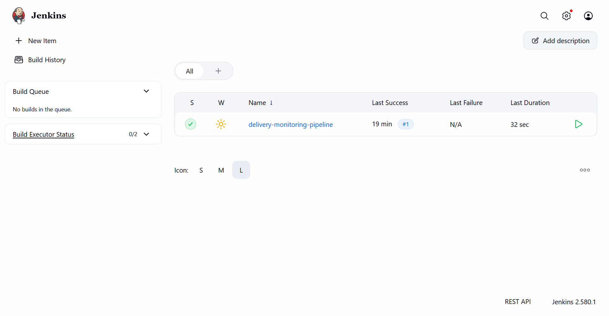
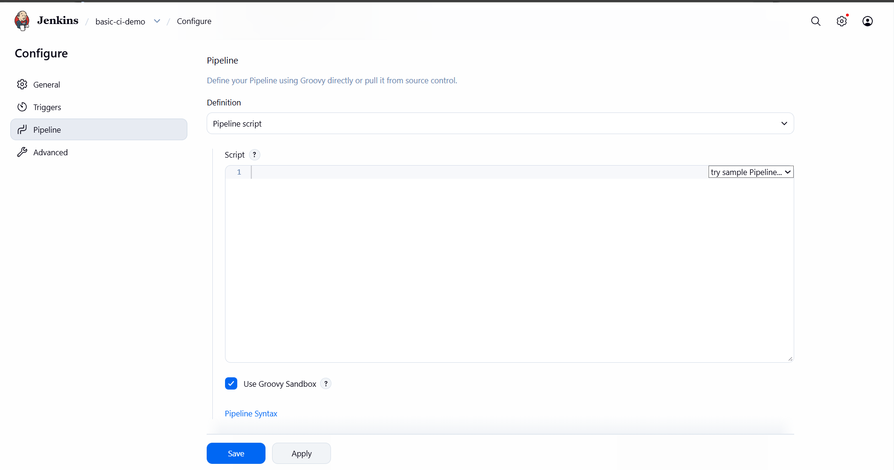
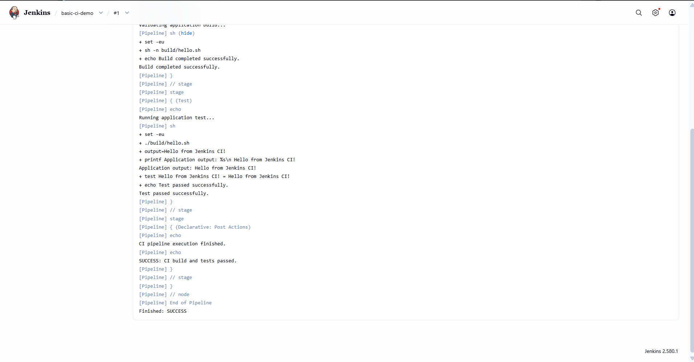
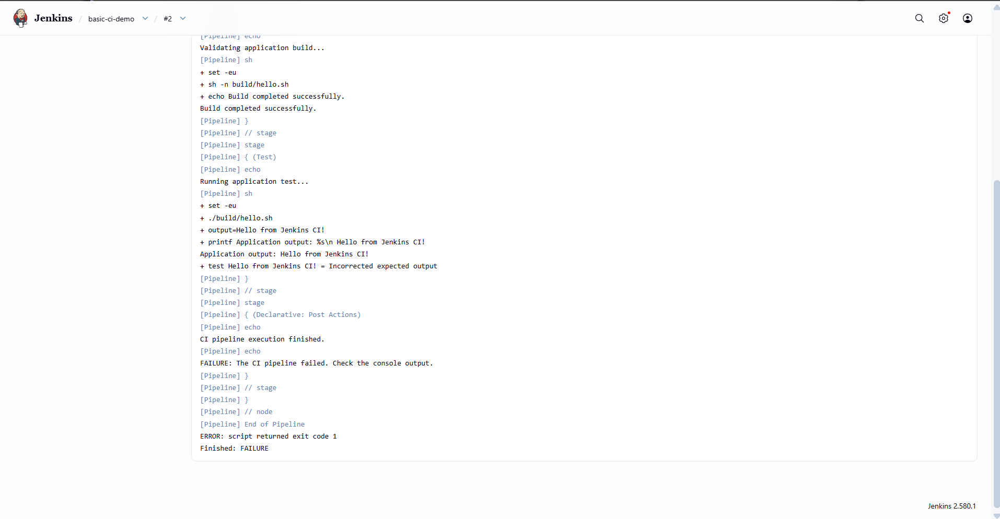
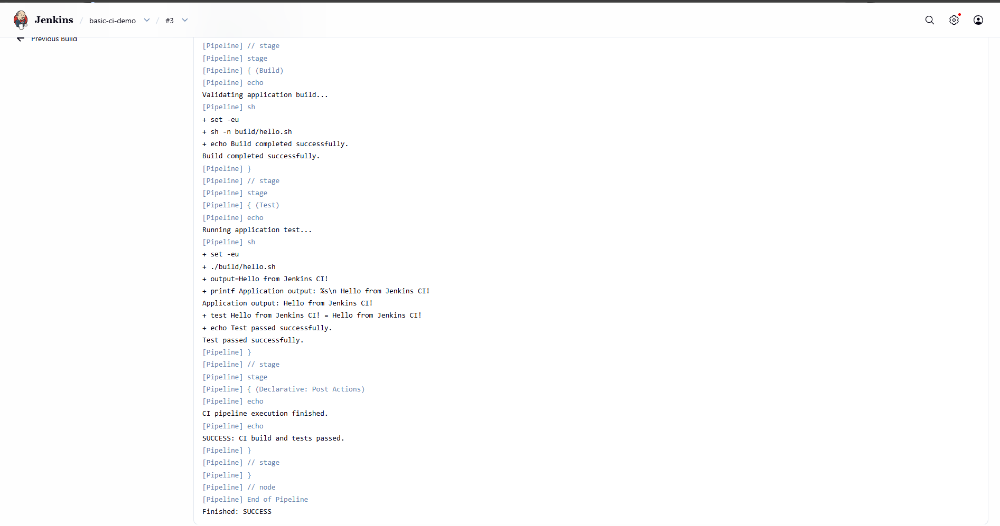

# Exercise 7 – Introduction to Continuous Integration (CI) and Jenkins Installation

## Objective

The objective of this exercise is to understand the fundamentals of Continuous Integration (CI), learn about Jenkins as a CI automation tool, and configure a Jenkins pipeline to demonstrate an automated build and testing workflow.

The exercise covers:

- Understanding Continuous Integration and its importance in software development.
- Learning the basic concepts and workflow of Jenkins.
- Setting up and accessing Jenkins using Docker.
- Creating and configuring a Jenkins Pipeline job.
- Automating application source preparation, build validation, and testing.
- Observing successful and failed builds through Jenkins Console Output.
- Understanding how automated feedback helps developers identify errors early.

---

## 1. Introduction to Continuous Integration

Continuous Integration is a software development practice in which developers integrate code changes into a shared repository frequently. Each change can be validated through an automated build and testing process.

The purpose of CI is to identify integration problems and software defects early in the development process.

### Benefits of Continuous Integration

- **Early Bug Detection:** Automated tests help identify defects soon after changes are introduced.
- **Improved Collaboration:** Developers integrate their changes regularly, reducing integration conflicts.
- **Faster Development Cycles:** Automated build and test processes reduce repetitive manual work.
- **Improved Code Quality:** Consistent validation helps maintain reliable software.
- **Immediate Feedback:** Developers can inspect build results and investigate failures quickly.

### Basic CI Workflow

1. A developer makes changes to the application source code.
2. The changes are committed and pushed to a shared repository.
3. A CI server retrieves or receives the updated code.
4. The application is built or validated.
5. Automated tests are executed.
6. The CI server reports whether the build and tests succeeded or failed.
7. Developers investigate failures and make the necessary corrections.

**Note:** In this exercise, the demonstration pipeline is started manually using Jenkins' **Build Now** option. Automatic execution on Git pushes or webhook integration is not configured.

---

## 2. Introduction to Jenkins

[Jenkins](https://www.jenkins.io/) is an open-source automation server used to automate software development tasks, including building, testing, and deploying applications.

Jenkins supports automation through jobs, pipelines, plugins, and distributed build agents.

### Important Jenkins Concepts

| Concept | Description |
|---|---|
| Job | A configured task that Jenkins can execute. |
| Build | A single execution of a Jenkins job. |
| Pipeline | A sequence of automated stages that defines a workflow. |
| Stage | A logical section of a pipeline, such as Build or Test. |
| Plugin | An extension that adds functionality to Jenkins. |
| Agent | A system or execution environment where pipeline steps run. |
| Console Output | The log containing messages, commands, errors, and build results. |

### Examples of CI Tools

- Jenkins
- GitHub Actions
- GitLab CI/CD
- CircleCI
- Azure Pipelines

---

## 3. Jenkins Setup Using Docker

Jenkins was already installed and running in the Docker environment configured during the previous exercise. The same instance was reused to avoid creating a second container and conflicting with existing ports.

### Environment Details

| Component | Configuration |
|---|---|
| Automation Server | Jenkins |
| Container Name | `jenkins-ex6` |
| Docker Image | `jenkins/jenkins:lts` |
| Jenkins Dashboard | `http://localhost:8082` |
| Jenkins Web Port | `8082:8080` |
| Agent Communication Port | `50001:50000` |
| Operating Environment | Windows with Docker Desktop |

### Verify the Jenkins Container

Run the following command in PowerShell:

```powershell
docker ps --filter "name=jenkins-ex6"
```

The container should appear in the output with a running status.

### Access the Jenkins Dashboard

Open the following URL in a web browser:

```text
http://localhost:8082
```

After authentication, the Jenkins dashboard can be used to create jobs, configure pipelines, execute builds, and inspect results.

### Screenshot 1: Jenkins Dashboard



---

## 4. Creating a Jenkins Pipeline Job

A new Jenkins Pipeline job named `basic-ci-demo` was created to demonstrate a basic CI workflow.

### Procedure

1. Open the Jenkins dashboard.
2. Click **New Item**.
3. Enter the item name `basic-ci-demo`.
4. Select **Pipeline**.
5. Click **OK**.
6. Scroll down to the **Pipeline** section.
7. Set **Definition** to `Pipeline script`.
8. Enter the pipeline script provided below.
9. Click **Save** to store the configuration.

### Screenshot 2: CI Pipeline Configuration



---

## 5. Jenkins Pipeline Script

The following pipeline demonstrates three stages:

1. **Prepare Source:** Creates a small shell application.
2. **Build:** Checks the shell script for syntax errors.
3. **Test:** Runs the application and verifies its output.

The pipeline also reports whether the execution succeeds or fails.

### Pipeline Script

```groovy
pipeline {
    agent any

    stages {
        stage('Prepare Source') {
            steps {
                echo 'Preparing application source...'
                sh '''
                    set -eu
                    mkdir -p build

                    cat > build/hello.sh <<'EOF'
#!/bin/sh
set -eu
printf '%s\\n' 'Hello from Jenkins CI!'
EOF

                    chmod +x build/hello.sh
                '''
            }
        }

        stage('Build') {
            steps {
                echo 'Validating application build...'
                sh '''
                    set -eu
                    sh -n build/hello.sh
                    echo "Build completed successfully."
                '''
            }
        }

        stage('Test') {
            steps {
                echo 'Running application test...'
                sh '''
                    set -eu
                    output="$(./build/hello.sh)"
                    printf 'Application output: %s\\n' "$output"

                    test "$output" = "Hello from Jenkins CI!"
                    echo "Test passed successfully."
                '''
            }
        }
    }

    post {
        success {
            echo 'SUCCESS: CI build and tests passed.'
        }
        failure {
            echo 'FAILURE: The CI pipeline failed. Check the console output.'
        }
        always {
            echo 'CI pipeline execution finished.'
        }
    }
}
```

### Explanation of the Pipeline

**Prepare Source**

Creates a `build` directory and generates a shell script named `hello.sh`. The script prints a predefined message.

**Build**

Uses `sh -n` to check the generated shell script for syntax errors. If the validation succeeds, the build stage continues.

**Test**

Executes the application, captures its output, and compares it against the expected message:

```text
Hello from Jenkins CI!
```

The test passes only when the actual output matches the expected output.

**Post Actions**

- `success`: Prints a success message when the pipeline succeeds.
- `failure`: Prints a failure message when a pipeline step fails.
- `always`: Prints a message regardless of the final build result.

---

## 6. Executing the CI Pipeline

After saving the job configuration, the pipeline was executed using Jenkins.

### Procedure

1. Open the `basic-ci-demo` job.
2. Click **Build Now**.
3. Wait for the build to finish.
4. Open the build number from **Build History**.
5. Click **Console Output**.
6. Verify that the source preparation, build validation, and test stages complete successfully.

### Expected Output

The console output should include messages similar to:

```text
Preparing application source...
Validating application build...
Build completed successfully.
Running application test...
Application output: Hello from Jenkins CI!
Test passed successfully.
SUCCESS: CI build and tests passed.
CI pipeline execution finished.
Finished: SUCCESS
```

### Screenshot 3: Successful CI Pipeline



---

## 7. Demonstrating Test Failure Detection

A CI pipeline must detect unsuccessful tests as well as successful ones. To demonstrate this behavior, the expected output in the test stage was temporarily modified to an incorrect value.

### Procedure

1. Open `basic-ci-demo` and click **Configure**.
2. Locate the test assertion in the pipeline script.
3. Temporarily replace the correct assertion:

```sh
test "$output" = "Hello from Jenkins CI!"
```

with an intentionally incorrect assertion:

```sh
test "$output" = "Incorrect expected output"
```

4. Save the configuration.
5. Click **Build Now**.
6. Open the new build and inspect **Console Output**.

### Expected Result

The application continues to print:

```text
Hello from Jenkins CI!
```

However, the test expects a different message. Therefore, the test fails and Jenkins marks the pipeline build as failed.

The pipeline's `failure` post action prints:

```text
FAILURE: The CI pipeline failed. Check the console output.
```

This demonstrates how automated testing can identify incorrect expectations and provide immediate feedback.

**Important:** The incorrect expected value was introduced only for testing failure handling. The correct assertion was restored afterward.

### Screenshot 4: CI Test Failure



---

## 8. Restoring the Pipeline and Verifying Success

After demonstrating failure detection, the original expected output was restored.

### Procedure

1. Open `basic-ci-demo` and click **Configure**.
2. Restore the correct test assertion:

```sh
test "$output" = "Hello from Jenkins CI!"
```

3. Click **Save**.
4. Open the job and click **Build Now**.
5. Open the latest build and select **Console Output**.
6. Confirm that the test passes and the final build status is **Success**.

### Expected Result

The latest build should finish with:

```text
SUCCESS: CI build and tests passed.
CI pipeline execution finished.
Finished: SUCCESS
```

The failed build from the previous step remains in the build history, demonstrating both failure detection and recovery after correcting the test.

### Screenshot 5: Final Successful Build



---

## 9. Results

The exercise was completed successfully.

- Studied the purpose, benefits, and workflow of Continuous Integration.
- Understood Jenkins jobs, builds, stages, pipelines, and console logs.
- Accessed Jenkins through Docker using the existing Jenkins instance.
- Created and configured the `basic-ci-demo` Pipeline job.
- Automated source preparation, build validation, and a basic application test.
- Verified that the pipeline reports a successful build when the test passes.
- Deliberately introduced an incorrect expected value and observed the resulting test failure.
- Restored the correct assertion and verified a successful final build.

The exercise demonstrated how Jenkins can automate validation tasks and provide feedback about software quality.

---

## 10. Key Takeaways

1. Continuous Integration encourages frequent integration and automated validation of code changes.
2. Jenkins pipelines define repeatable workflows using stages and steps.
3. Automated tests can identify incorrect behavior without requiring manual verification for each build.
4. Jenkins reports pipeline status and displays logs that help developers diagnose failures.
5. A failed build should be investigated and corrected before treating the workflow as successful.
6. This demonstration uses manual build triggering. Connecting a source repository and configuring webhooks would be required to automate builds on new commits.

---

## 11. Folder Structure

The Exercise 7 files are organized as follows:

```text
7-Jenkins-CI-Automation/
├── README.md
└── Images/
    ├── ex7-01-jenkins-dashboard.png
    ├── ex7-02-ci-pipeline-configuration.png
    ├── ex7-03-ci-pipeline-success.png
    ├── ex7-04-ci-test-failure.png
    └── ex7-05-ci-final-success.png
```

The pipeline script is stored in the Jenkins job configuration. It is included in this README for documentation and reproducibility.

---

## Conclusion

This exercise introduced Continuous Integration and demonstrated Jenkins as an automation server. A basic pipeline was configured to prepare application source code, validate the build, and run an automated test. Both successful execution and intentional test failure were observed, followed by a successful run after restoring the correct test assertion.

The exercise illustrates how automated build validation, testing, and feedback can support more reliable software development workflows.