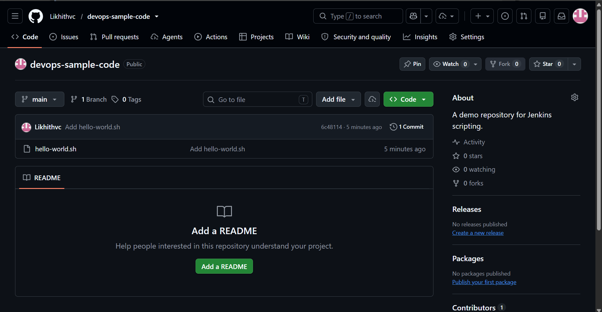
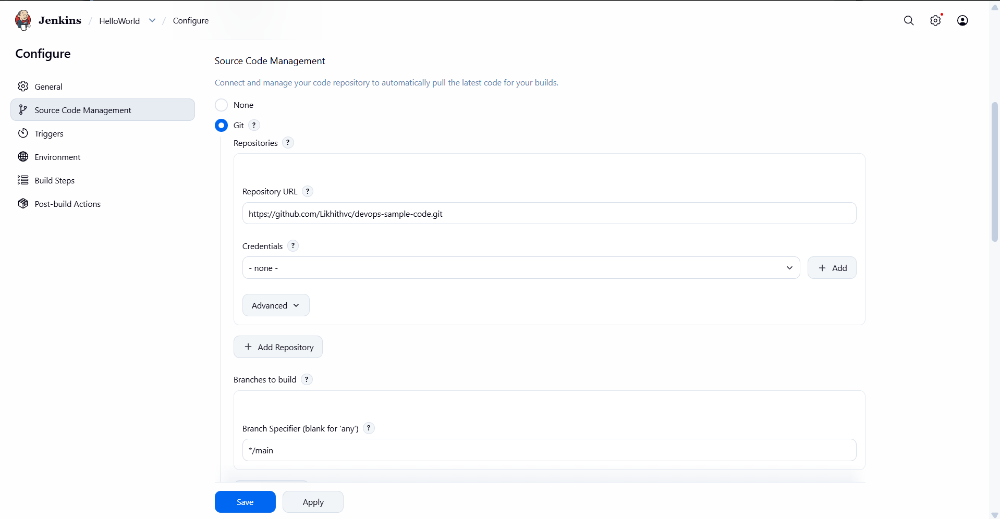
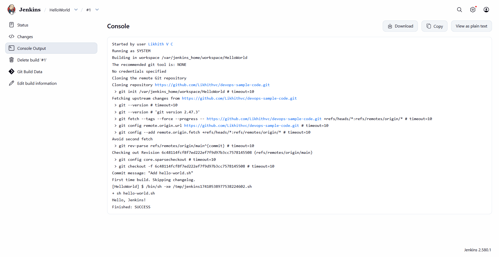

# Exercise 8 – Creating a Hello World Jenkins Job

## Objective

The objective of this exercise is to create a simple shell script, store it in a GitHub repository, and configure a Jenkins Freestyle project to retrieve and execute the script automatically when a build is triggered.

The exercise covers:

- Creating a public GitHub repository.
- Writing a shell script named `hello-world.sh`.
- Initializing a local Git repository and pushing the script to GitHub.
- Understanding GitHub Personal Access Token (PAT) authentication.
- Configuring Jenkins Source Code Management using Git.
- Creating and executing a Jenkins Freestyle project.
- Viewing and verifying build logs using Jenkins Console Output.

---

## 1. Create a GitHub Repository

A public GitHub repository named `devops-sample-code` was created to store the shell script used in this exercise.

### Repository Details

| Property | Value |
|---|---|
| Repository Name | `devops-sample-code` |
| Description | A demo repository for Jenkins scripting |
| Visibility | Public |
| Default Branch | `main` |
| Script File | `hello-world.sh` |

### GitHub Repository

Repository URL:

[devops-sample-code](https://github.com/Likhithvc/devops-sample-code)

The repository contains the shell script that Jenkins retrieves and executes during the build.

---

## 2. Create the Hello World Shell Script

A shell script named `hello-world.sh` was created locally.

### Script Content

```bash
#!/bin/bash
echo "Hello, Jenkins!"
```

### Explanation

- `#!/bin/bash` specifies Bash as the interpreter.
- `echo "Hello, Jenkins!"` prints a message to the console when the script runs.

### Create the Script Using PowerShell

The script was created using the following PowerShell commands:

```powershell
[System.IO.File]::WriteAllText(
    (Join-Path (Get-Location) "hello-world.sh"),
    "#!/bin/bash`necho `"Hello, Jenkins!`"`n"
)
```

The file content was verified using:

```powershell
Get-Content .\hello-world.sh
```

Expected output:

```text
#!/bin/bash
echo "Hello, Jenkins!"
```

---

## 3. Initialize Git and Commit the Script

The local repository was cloned from GitHub:

```powershell
git clone https://github.com/Likhithvc/devops-sample-code.git
```

The following commands were executed from inside the cloned repository.

### Navigate to the Repository

```powershell
Set-Location "$HOME\Documents\devops-sample-code"
```

### Stage the Script

```powershell
git add hello-world.sh
```

### Verify Git Status

```powershell
git status
```

The script appeared as a new file ready to be committed.

### Commit the Changes

```powershell
git commit -m "Add hello-world.sh"
```

### Push the Script to GitHub

```powershell
git push -u origin main
```

After the push completed successfully, `hello-world.sh` was available in the public GitHub repository.

**Note:** Since the repository was created on GitHub and then cloned locally, the `origin` remote was already configured. A separate `git init` and `git remote add origin` were not required.

---

## 4. GitHub Personal Access Token

A Personal Access Token (PAT) can be used to authenticate Git operations over HTTPS when GitHub requests a token.

Official GitHub documentation:

[Creating a fine-grained personal access token](https://docs.github.com/en/authentication/keeping-your-account-and-data-secure/managing-your-personal-access-tokens#creating-a-fine-grained-personal-access-token)

For this exercise:

- A PAT may be used if GitHub requests HTTPS authentication.
- The token should have only the permissions necessary for the operation.
- The token must never be committed to a repository or shared publicly.
- Because the repository is public, Jenkins can clone it without GitHub credentials.

---

## 5. Verify the Script on GitHub

After pushing the changes, the repository was opened in a web browser to verify that the file was uploaded correctly.

Repository:

[devops-sample-code](https://github.com/Likhithvc/devops-sample-code)

The `hello-world.sh` file contains:

```bash
#!/bin/bash
echo "Hello, Jenkins!"
```

### Screenshot 1: Hello World Script on GitHub



---

## 6. Ensure Jenkins Is Running

Jenkins was already installed and running in Docker from the previous exercises. The existing instance was reused rather than installing another Jenkins container.

### Environment Details

| Component | Configuration |
|---|---|
| Automation Server | Jenkins |
| Container Name | `jenkins-ex6` |
| Docker Image | `jenkins/jenkins:lts` |
| Jenkins Dashboard | `http://localhost:8082` |
| Host-to-Container Web Port | `8082:8080` |
| Host-to-Container Agent Port | `50001:50000` |

### Verify the Jenkins Container

Run this command in PowerShell:

```powershell
docker ps --filter "name=jenkins-ex6"
```

The container should appear with a running status.

Open the Jenkins dashboard:

[http://localhost:8082](http://localhost:8082)

Log in using the existing Jenkins credentials.

---

## 7. Create a Jenkins Freestyle Project

A Jenkins Freestyle project named `HelloWorld` was created to retrieve the shell script from GitHub and execute it.

### Procedure

1. Open the Jenkins dashboard.
2. Click **New Item**.
3. Enter `HelloWorld` as the job name.
4. Select **Freestyle project**.
5. Click **OK** to create the job.

### General Configuration

In the **Description** field, enter:

```text
Hello World! Jenkins job.
```

### Source Code Management

1. Navigate to the **Source Code Management** section.
2. Select **Git**.
3. Enter the repository URL:

```text
https://github.com/Likhithvc/devops-sample-code.git
```

4. Under **Branches to build**, specify:

```text
*/main
```

5. Since the repository is public, leave the Git credentials setting as `- none -`.

This configuration allows Jenkins to retrieve the script from the `main` branch.

### Build Configuration

1. Scroll to the **Build** section.
2. Click **Add build step**.
3. Select **Execute shell**.
4. Enter the following command:

```sh
sh hello-world.sh
```

Jenkins first checks out the repository into the job workspace. The build step then runs the script from that workspace.

### Save the Job

Click **Save** to store the configuration.

### Screenshot 2: HelloWorld Job Configuration



---

## 8. Execute the Jenkins Job

After saving the configuration, the job was executed manually.

### Procedure

1. Open the `HelloWorld` job in Jenkins.
2. Click **Build Now**.
3. Wait for the build to complete.
4. Locate the latest build in **Build History**.
5. Click the build number, such as `#1`.
6. Click **Console Output** to inspect the execution logs.

### Expected Console Output

The output should contain messages similar to the following:

```text
Started by user ...
Building in workspace /var/jenkins_home/workspace/HelloWorld
[HelloWorld] $ /bin/sh -xe ...
+ sh hello-world.sh
Hello, Jenkins!
Finished: SUCCESS
```

The exact log messages, temporary script path, and build number may differ depending on the environment.

### Verification

The job is considered successful when:

- Jenkins successfully checks out the GitHub repository.
- The shell script executes without errors.
- The message `Hello, Jenkins!` appears in the console output.
- The build finishes with `Finished: SUCCESS`.

### Screenshot 3: Successful HelloWorld Build



---

## 9. How the Jenkins Job Works

The job follows a simple CI workflow.

1. **Source Repository:** The shell script is stored in the GitHub repository.
2. **Source Code Checkout:** Jenkins clones or updates the repository in the job workspace.
3. **Build Step:** Jenkins executes `sh hello-world.sh`.
4. **Script Execution:** The shell runs the script and prints `Hello, Jenkins!`.
5. **Build Result:** Jenkins records the console logs and marks the build as successful if all steps complete successfully.

This demonstrates how Jenkins can retrieve source code from version control and execute automated commands.

**Build triggering:** In this exercise, the build is started manually using **Build Now**. Automatic triggers on GitHub pushes would require additional job configuration, such as polling or a webhook.

---

## 10. Results

The exercise was completed successfully.

- Created a GitHub repository named `devops-sample-code`.
- Created the `hello-world.sh` script.
- Committed and pushed the script to the GitHub repository.
- Verified the script in the public repository.
- Reused the existing Jenkins Docker instance.
- Created a Jenkins Freestyle project named `HelloWorld`.
- Configured Git as the Source Code Management provider.
- Configured the shell command `sh hello-world.sh` as the build step.
- Triggered the Jenkins build and examined its Console Output.
- Verified that the application printed `Hello, Jenkins!` and the build completed successfully.

---

## 11. Key Takeaways

1. GitHub can be used to store and version-control scripts.
2. Jenkins can retrieve code from a Git repository through Source Code Management.
3. A Freestyle project can execute shell commands as part of a build.
4. The Jenkins workspace contains the checked-out source files used by the job.
5. Console Output provides useful information for verifying execution and diagnosing errors.
6. A successful build confirms that the configured checkout and build steps completed without reported errors.

---

## 12. Project Structure

The Exercise 8 documentation and screenshots are organized as follows:

```text
8-Jenkins-Hello-World-Job/
├── README.md
└── Images/
    ├── ex8-01-helloworld-job-configuration.png
    ├── ex8-02-helloworld-build-success.png
    └── ex8-03-hello-world-script-on-github.png
```

The executable shell script is maintained in the separate GitHub repository:

[devops-sample-code](https://github.com/Likhithvc/devops-sample-code)

---

## Conclusion

This exercise demonstrated how to connect Jenkins to a GitHub repository and run a shell script through a Freestyle project. Jenkins retrieved `hello-world.sh`, executed it in the job workspace, displayed the expected message, and reported a successful build.

The exercise introduced the fundamental integration between GitHub, Git, shell scripting, and Jenkins, providing a foundation for more advanced CI pipelines and automated build workflows.