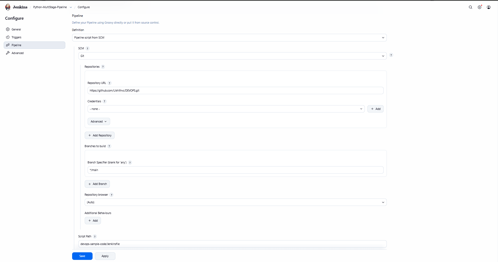
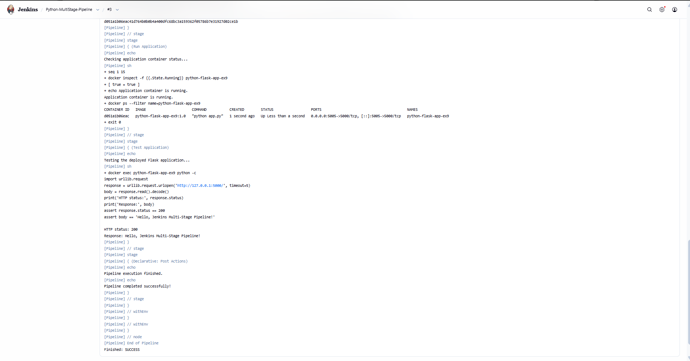
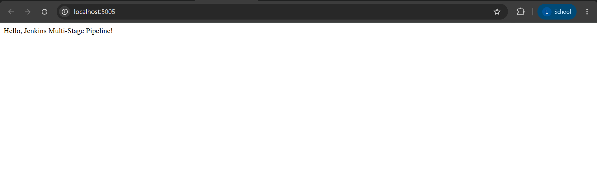

# Exercise 9 – Jenkins Multi-Stage Pipeline for Deploying a Python Flask Application

## 1. Objective

The objective of this exercise is to create and execute a multi-stage Jenkins Pipeline to automate the build, testing, deployment, and verification of a Python Flask application.

The pipeline demonstrates the use of Jenkins, Docker, Python, Flask, Git, and automated unit testing to implement a basic CI/CD workflow.

### Key Objectives

- Create a sample Python Flask application.
- Store the application and `Jenkinsfile` in a GitHub repository.
- Configure Jenkins to retrieve a pipeline script from GitHub.
- Build a Docker image for the Flask application.
- Run automated unit tests.
- Deploy the application in a Docker container.
- Verify the deployed application through an HTTP request.
- Inspect pipeline execution logs and build results.

---

## 2. Scenario

A Python Flask application needs to be built, tested, and deployed automatically using Jenkins.

The application exposes a single endpoint at `/` that returns:

```text
Hello, Jenkins Multi-Stage Pipeline!
```

The Jenkins Pipeline automates the following stages:

1. **Build:** Build a Docker image containing the Flask application and its dependencies.
2. **Test:** Execute automated unit tests inside the Docker image.
3. **Deploy:** Start the application in a Docker container.
4. **Run Application:** Verify that the application container is running.
5. **Test Application:** Send an HTTP request to the deployed application and validate its response.

---

## 3. Technologies Used

| Technology | Purpose |
|---|---|
| Jenkins | Pipeline automation and build execution |
| Git | Source code version control |
| GitHub | Remote repository hosting |
| Docker | Application containerization and deployment |
| Python 3.11 | Application runtime |
| Flask | Python web framework |
| unittest | Automated application testing |
| PowerShell | Local development and Docker commands |

---

## 4. GitHub Repository

The application and Jenkins Pipeline are maintained in the following repository:

**Repository:** [Likhithvc/DEVOPS](https://github.com/Likhithvc/DEVOPS)

**Application directory:** [devops-sample-code](https://github.com/Likhithvc/DEVOPS/tree/main/devops-sample-code)

**Jenkinsfile:** [View Jenkinsfile](https://github.com/Likhithvc/DEVOPS/blob/main/devops-sample-code/Jenkinsfile)

### Repository Structure

```text
DEVOPS/
├── 9-Jenkins-Multi-Stage-Pipeline/
│   ├── README.md
│   └── Images/
│       ├── ex9-01-pipeline-configuration.png
│       ├── ex9-02-pipeline-success.png
│       └── ex9-03-deployed-flask-application.png
│
└── devops-sample-code/
    ├── Jenkinsfile
    └── python-flask-app/
        ├── Dockerfile
        ├── app.py
        ├── requirements.txt
        └── test_app.py
```

The paths above describe the organization of the Exercise 9 files. The Jenkinsfile and application files are stored in `devops-sample-code`, while this README and its screenshots are stored in the main `DEVOPS` repository.

---

## 5. Setting Up the Python Flask Application

The application was created in the `python-flask-app` directory.

### 5.1 Application File: `app.py`

```python
from flask import Flask

app = Flask(__name__)

@app.route("/")
def home():
    return "Hello, Jenkins Multi-Stage Pipeline!"

if __name__ == "__main__":
    app.run(host="0.0.0.0", port=5000, debug=False)
```

**Explanation:**

- `Flask(__name__)` initializes the Flask application.
- The `/` route returns a text response.
- The application listens on port `5000`.
- `host="0.0.0.0"` allows the application to accept connections through the Docker container's network interface.
- Debug mode is disabled.

### 5.2 Dependencies: `requirements.txt`

```text
Flask==2.1.2
Werkzeug==2.1.2
```

This file specifies the Flask web framework and a compatible Werkzeug version.

### 5.3 Unit Tests: `test_app.py`

```python
import unittest
from app import app


class TestApp(unittest.TestCase):
    def test_home(self):
        tester = app.test_client()
        response = tester.get("/")

        print(response.data.decode("utf-8"))

        self.assertEqual(response.status_code, 200)
        self.assertEqual(
            response.data.decode("utf-8"),
            "Hello, Jenkins Multi-Stage Pipeline!"
        )


if __name__ == "__main__":
    unittest.main()
```

The unit test verifies that:

- The home endpoint responds with HTTP status `200`.
- The response body matches the expected message.
- The application returns the correct output.

---

## 6. Dockerizing the Application

A Dockerfile was created to package the application and its dependencies into a Docker image.

### Dockerfile

```dockerfile
FROM python:3.11-slim

WORKDIR /app

COPY requirements.txt .
RUN python -m pip install --no-cache-dir -r requirements.txt

COPY app.py .
COPY test_app.py .

EXPOSE 5000

CMD ["python", "app.py"]
```

### Explanation

- `FROM python:3.11-slim` selects a lightweight Python base image.
- `WORKDIR /app` sets the working directory.
- `COPY requirements.txt .` copies the dependency file.
- `RUN python -m pip install ...` installs the dependencies.
- `COPY app.py .` and `COPY test_app.py .` add the application and tests.
- `EXPOSE 5000` documents the application's listening port.
- `CMD ["python", "app.py"]` starts the Flask application when the container runs.

The Docker image is named:

```text
python-flask-app-ex9:1.0
```

---

## 7. Jenkins Setup and Configuration

Jenkins was already running in Docker from the previous exercises, so the existing instance was reused.

### Jenkins Environment

| Property | Value |
|---|---|
| Jenkins container | `jenkins-ex6` |
| Jenkins dashboard | `http://localhost:8082` |
| Jenkins job | `Python-MultiStage-Pipeline` |
| Source repository | `https://github.com/Likhithvc/DEVOPS.git` |
| Branch | `main` |
| Pipeline script path | `devops-sample-code/Jenkinsfile` |

### Jenkins Pipeline Configuration

The Jenkins job was configured as follows:

1. Open the Jenkins dashboard.
2. Click **New Item**.
3. Enter `Python-MultiStage-Pipeline`.
4. Select **Pipeline** and click **OK**.
5. Scroll to the Pipeline section.
6. Select **Pipeline script from SCM** as the definition.
7. Select **Git** as the source control management system.
8. Enter the repository URL:

   ```text
   https://github.com/Likhithvc/DEVOPS.git
   ```

9. Set the branch specifier to:

   ```text
   */main
   ```

10. Set the Script Path to:

    ```text
    devops-sample-code/Jenkinsfile
    ```

11. Save the configuration.

Because the repository is public, no Git credentials were required for checkout.

### Screenshot 1: Pipeline Configuration



---

## 8. Jenkinsfile: Multi-Stage Pipeline

The Jenkinsfile defines the complete CI/CD workflow.

### Jenkinsfile

```groovy
pipeline {
    agent any

    environment {
        APP_IMAGE = 'python-flask-app-ex9:1.0'
        APP_CONTAINER = 'python-flask-app-ex9'
        APP_NETWORK = 'python-flask-app-ex9-net'
    }

    stages {
        stage('Build') {
            steps {
                echo 'Building the Python Flask Docker image...'
                sh 'docker build -t "$APP_IMAGE" devops-sample-code/python-flask-app'
            }
        }

        stage('Test') {
            steps {
                echo 'Running Python unit tests...'
                sh 'docker run --rm --entrypoint python "$APP_IMAGE" -m unittest discover -s .'
            }
        }

        stage('Deploy') {
            steps {
                echo 'Deploying the Flask application...'
                sh '''
                    docker network inspect "$APP_NETWORK" >/dev/null 2>&1 || \
                        docker network create "$APP_NETWORK"

                    docker rm -f "$APP_CONTAINER" >/dev/null 2>&1 || true

                    docker run -d \
                        --name "$APP_CONTAINER" \
                        --network "$APP_NETWORK" \
                        --restart unless-stopped \
                        -p 5005:5000 \
                        "$APP_IMAGE"
                '''
            }
        }

        stage('Run Application') {
            steps {
                echo 'Checking application container status...'
                sh '''
                    for i in $(seq 1 15); do
                        if [ "$(docker inspect -f '{{.State.Running}}' "$APP_CONTAINER" 2>/dev/null)" = "true" ]; then
                            echo "Application container is running."
                            docker ps --filter "name=$APP_CONTAINER"
                            exit 0
                        fi
                        sleep 2
                    done

                    echo "Application container failed to start."
                    docker logs "$APP_CONTAINER" || true
                    exit 1
                '''
            }
        }

        stage('Test Application') {
            steps {
                echo 'Testing the deployed Flask application...'
                sh '''
                    docker exec "$APP_CONTAINER" python -c "
import urllib.request
response = urllib.request.urlopen('http://127.0.0.1:5000/', timeout=5)
body = response.read().decode()
print('HTTP status:', response.status)
print('Response:', body)
assert response.status == 200
assert body == 'Hello, Jenkins Multi-Stage Pipeline!'
"
                '''
            }
        }
    }

    post {
        success {
            echo 'Pipeline completed successfully!'
        }
        failure {
            echo 'Pipeline failed. Check the logs for more details.'
        }
        always {
            echo 'Pipeline execution finished.'
        }
    }
}
```

### Pipeline Environment Variables

| Variable | Description |
|---|---|
| `APP_IMAGE` | Docker image name and tag |
| `APP_CONTAINER` | Name of the deployed container |
| `APP_NETWORK` | Docker network used by the application |

### Stage 1: Build

The Build stage executes:

```sh
docker build -t "$APP_IMAGE" devops-sample-code/python-flask-app
```

This builds the Docker image using the Dockerfile in the application directory. The image contains Python, Flask, the application source code, and the test file.

### Stage 2: Test

The Test stage executes:

```sh
docker run --rm --entrypoint python "$APP_IMAGE" -m unittest discover -s .
```

The command runs Python's `unittest` framework inside a temporary container created from the application image.

The `--rm` option removes the temporary test container after execution.

The pipeline proceeds only if the unit tests pass.

### Stage 3: Deploy

The Deploy stage:

1. Creates the application Docker network if it does not already exist.
2. Removes the previous application container if one exists.
3. Starts a new container using the built image.
4. Maps host port `5005` to container port `5000`.

The application is made available at:

```text
http://localhost:5005
```

### Stage 4: Run Application

This stage checks whether the application container is running.

It retries the status check before reporting a failure and prints the container information when the container starts successfully.

### Stage 5: Test Application

The final stage sends an HTTP request to the deployed application from inside the running container.

It verifies:

- HTTP status code `200`.
- The expected response message.

If either assertion fails, the pipeline reports a failure.

### Post Actions

The pipeline includes post-build actions:

- `success`: Prints a success message after all stages pass.
- `failure`: Prints a failure message when a stage fails.
- `always`: Prints a message after pipeline execution.

---

## 9. Running the Pipeline

After configuring the Jenkins job, the pipeline was triggered manually.

### Procedure

1. Open the Jenkins dashboard.
2. Select `Python-MultiStage-Pipeline`.
3. Click **Build Now**.
4. Open the latest build from Build History.
5. Select **Console Output**.
6. Inspect the output of each stage.

### Build and Test Output

The Build stage successfully created the Docker image.

```text
Successfully built e226b5a356f0
Successfully tagged python-flask-app-ex9:1.0
```

The unit test completed successfully:

```text
Hello, Jenkins Multi-Stage Pipeline!
.
----------------------------------------------------------------------
Ran 1 test in 0.054s

OK
```

### Deployment Output

The deployment stage started the application container with the following configuration:

```text
python-flask-app-ex9:1.0
0.0.0.0:5005->5000/tcp
python-flask-app-ex9
```

The container was confirmed to be running.

### Application Verification Output

The final stage reported:

```text
HTTP status: 200
Response: Hello, Jenkins Multi-Stage Pipeline!
```

The pipeline completed with:

```text
Pipeline completed successfully!
Pipeline execution finished.
Finished: SUCCESS
```

### Screenshot 2: Successful Pipeline Execution



---

## 10. Verify the Deployed Application

The deployed Flask application is accessible through the host port `5005`.

### Application URL

[http://localhost:5005](http://localhost:5005)

### Expected Response

```text
Hello, Jenkins Multi-Stage Pipeline!
```

The application was verified using the browser and the Jenkins Test Application stage.

### Verify Using PowerShell

```powershell
Invoke-WebRequest http://localhost:5005 |
    Select-Object StatusCode, Content
```

Expected result:

- Status code: `200`
- Content: `Hello, Jenkins Multi-Stage Pipeline!`

### Verify the Container

```powershell
docker ps --filter "name=python-flask-app-ex9"
```

This command displays the running application container.

### Screenshot 3: Deployed Flask Application



---

## 11. Handling Build Errors

During the exercise, the initial pipeline attempt failed because the Docker build command used an incorrect path.

### Error

```text
unable to prepare context: path "python-flask-app" not found
```

### Cause

Jenkins checked out the root of the `DEVOPS` repository, while the application directory was nested inside `devops-sample-code`.

### Resolution

The Docker build command was corrected to use the path relative to the repository root:

```groovy
sh 'docker build -t "$APP_IMAGE" devops-sample-code/python-flask-app'
```

After this correction, Jenkins located the Dockerfile and application files, built the image, ran the tests, deployed the container, and verified the application successfully.

### Python Installation Issue

Python, pip, and virtual-environment support were not available inside the Jenkins controller container. An attempt to install them through Debian's package repositories failed because of network timeouts.

The pipeline was therefore implemented using the existing `python:3.11-slim` Docker image. Python dependencies are installed during the Docker image build, and both test execution and application deployment use the resulting image.

This avoids installing Python packages directly into the Jenkins controller.

---

## 12. Results

The exercise was completed successfully.

- Created a Python Flask application.
- Defined the application dependencies.
- Created a unit test for the home endpoint.
- Packaged the application into a Docker image.
- Configured Jenkins to retrieve the Jenkinsfile from the GitHub repository.
- Built the application image through Jenkins.
- Executed the automated unit test successfully.
- Deployed the application in a Docker container.
- Verified that the application container was running.
- Tested the deployed application and confirmed HTTP status `200`.
- Verified the expected response message.
- Achieved a successful final Jenkins pipeline execution.

---

## 13. Key Learnings

1. Jenkins Declarative Pipelines can organize a CI/CD workflow into separate stages.
2. Docker provides a consistent environment for building, testing, and running Python applications.
3. Automated unit testing helps identify application errors before deployment.
4. A pipeline can stop when a build or test stage fails.
5. Correct repository paths are essential when Jenkins checks out a project containing nested directories.
6. Deployment verification checks more than whether a container starts; it confirms that the application responds correctly.
7. Keeping application dependencies inside a Docker image avoids requiring Python to be installed directly in the Jenkins controller.

---

## 14. Conclusion

This exercise demonstrated a multi-stage Jenkins Pipeline for a Python Flask application. The pipeline built a Docker image, executed automated unit tests, deployed the application, verified the running container, and checked the application's HTTP response.

The final pipeline completed successfully, demonstrating how Jenkins and Docker can work together to automate application build, test, and deployment tasks.

The deployed application returned the expected response:

```text
Hello, Jenkins Multi-Stage Pipeline!
```